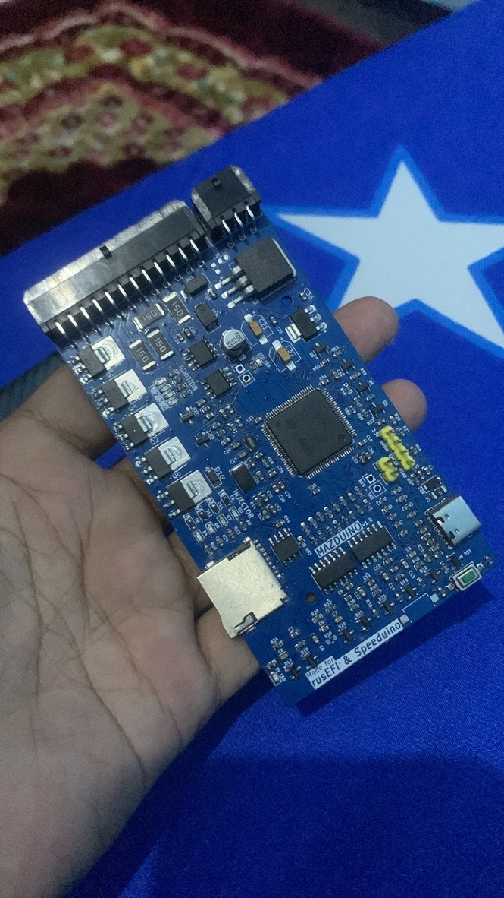

# Selamat Datang di Dokumentasi ECU Mazduino

Selamat datang di dokumentasi resmi untuk ECU Mazduino - unit kontrol mesin standalone open-source yang didukung oleh mikrokontroler STM32 dan kompatibel dengan firmware rusEFI dan Speeduino.

## Produk Saat Ini

### Mazduino Compact 4ch
Unit kontrol mesin 4-channel yang kompak dirancang untuk mesin yang lebih kecil dan aplikasi dengan keterbatasan ruang.

**Fitur Umum:**
- 4 channel injeksi
- Faktor bentuk kompak
- MCU STM32F407VGT6
- Kompatibel dengan rusEFI & Speeduino

**Versi yang Tersedia:**
- **[v1](mazduino-compact-4ch-v1.md)** - Konektor Microfit 30-pin (2x12 + 2x3)
- **[v2.1](mazduino-compact-4ch-v2.1.md)** - Konektor Yamaha 33-pin + Knock Sensor

### Mazduino Mini 6ch
Unit kontrol mesin 6-channel berfitur lengkap untuk kontrol injeksi sequential penuh.

**Fitur Umum:**
- 6 channel injeksi
- Operasi sequential penuh
- MCU STM32F407VGT6
- Kemampuan I/O yang diperluas
- Kompatibel dengan rusEFI & Speeduino

**Versi yang Tersedia:**
- **[v1.0-v1.2](mazduino-mini-6ch-v1.0-v1.2.md)** - Versi standar dengan fitur dasar
- **[v1.3](mazduino-mini-6ch-v1.3.md)** - Dengan Knock Input dan Electronic Throttle Body (ETB)

## Memulai

1. **Pilih Model Anda** - Pilih antara Compact 4ch atau Mini 6ch berdasarkan kebutuhan mesin Anda
2. **Install Firmware** - Flash firmware rusEFI atau Speeduino khusus
3. **Konfigurasi Pengaturan** - Atur parameter mesin dan pin mapping Anda
4. **Mulai Tuning** - Mulai dengan base map dan perbaiki untuk aplikasi spesifik Anda

## Bagian Dokumentasi

- **[Tentang](about.md)** - Pelajari lebih lanjut tentang proyek ECU Mazduino
- **Panduan Hardware** - Spesifikasi detail dan diagram wiring
- **Instalasi Firmware** - Petunjuk langkah demi langkah flashing firmware
- **Konfigurasi** - Setup mesin dan konfigurasi parameter
- **Panduan Tuning** - Optimisasi performa dan pemecahan masalah

## Dukungan

Untuk dukungan teknis, pertanyaan, atau kontribusi, silakan kunjungi forum komunitas kami atau repositori GitHub.
