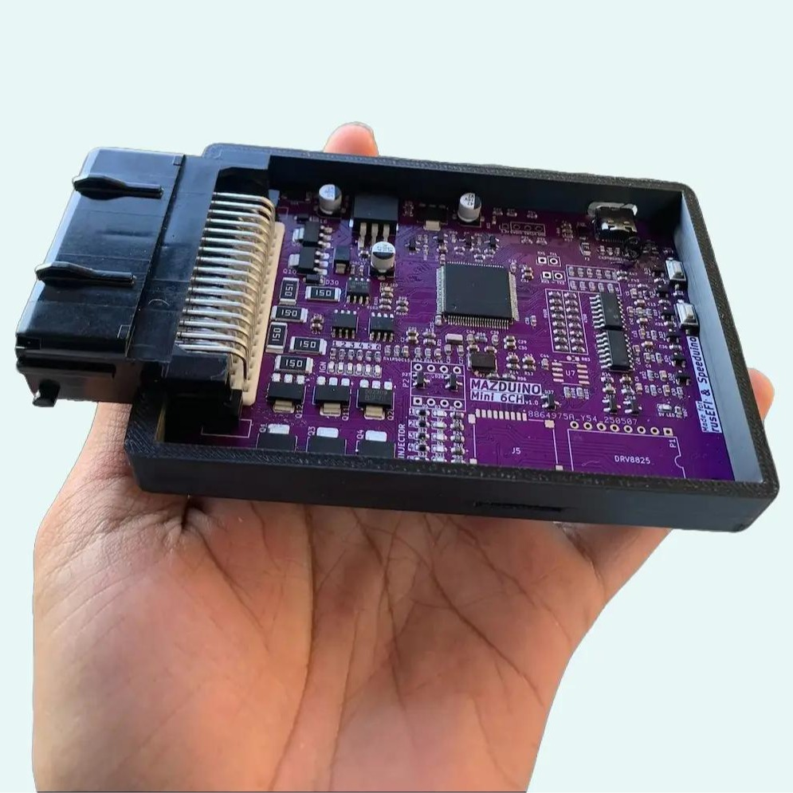

# Dokumentasi ECU Mazduino
Selamat datang di dokumentasi resmi untuk ECU Mazduino - Engine Control Unit standalone open-source yang didukung oleh mikrokontroler STM32 dan kompatibel dengan firmware rusEFI dan Speeduino.

## Produk Terbaru

### 🆕 Mazduino LITE
Solusi ECU compact terbaru untuk engine 4-silinder & Wasted Spark builtin IGBT dengan fitur modern.

**Fitur Unggulan:**
- 4 channel injector + 2 channel ignition
- 168 MHz ARM Cortex-M4 processor
- Support Hall/Optical dan VR sensors
- 6 analog inputs + 5 digital inputs
- CAN Bus, USB Type-C, Serial communication
- SD card data logging
- Konektor 30-pin Microfit (2x12 + 2x3)

**Ideal untuk:**
- Engine 4-silinder (NA, Turbo, Supercharged)
- Street dan track applications
- Motorcycle high-performance
- Marine dan industrial applications

**[📖 Dokumentasi Mazduino LITE v0.1](mazduino-lite-v0.1.md)**

**[📖 Dokumentasi Mazduino LITE v0.2](mazduino-lite-v0.2.md)** 

---

## Produk Lainnya

### Mazduino Compact 4ch
Engine Control Unit 4-channel yang kompak dirancang untuk mesin yang lebih kecil dan aplikasi dengan keterbatasan ruang.

| Mazduino Compact 4ch v1 | Mazduino Compact 4ch Latest |
|:------------------------:|:---------------------------:|
|  |  |

**Fitur Umum:**

- 4 channel injeksi
- Faktor bentuk kompak
- MCU STM32F407VGT6
- Kompatibel dengan rusEFI & Speeduino

**Versi yang Tersedia:**

- **[v1](mazduino-compact-4ch-v1.md)** - Konektor Microfit 30-pin (2x12 + 2x3)
- **[v2.1](mazduino-compact-4ch-v2.1.md)** - Konektor Yamaha 33-pin + Knock Sensor
- **[v2.2](mazduino-compact-4ch-v2.2.md)** - High Side Switching untuk alternator/VVT control

### Mazduino Mini 6ch
Engine Control Unit 6-channel berfitur lengkap untuk kontrol injeksi sequential penuh.

| Mazduino Mini 6ch | Mazduino Mini 6ch New Case |
|:-----------------:|:--------------------------:|
|  |  |

**Fitur Umum:**

- 6 channel injeksi
- Operasi sequential penuh
- MCU STM32F407VGT6
- Kemampuan I/O yang diperluas
- Kompatibel dengan rusEFI & Speeduino

**Versi yang Tersedia:**

- **[v1.0-v1.2](mazduino-mini-6ch-v1.0-v1.2.md)** - Versi standar dengan fitur dasar
- **[v1.3](mazduino-mini-6ch-v1.3.md)** - Dengan Knock Input dan Electronic Throttle Body (ETB)
- **[v1.3B](mazduino-mini-6ch-v1.3b.md)** - MCU STM32F427VGT6, input analog TPS2 tambahan, dan optimisasi hardware

## Memulai

1. **Pilih Model Anda** - Pilih antara Compact 4ch atau Mini 6ch berdasarkan kebutuhan mesin Anda
2. **Install Firmware** - Flash firmware rusEFI atau Speeduino khusus
3. **Konfigurasi Pengaturan** - Atur parameter mesin dan pin mapping Anda
4. **Mulai Tuning** - Mulai dengan base map dan perbaiki untuk aplikasi spesifik Anda

## Bagian Dokumentasi

- **[Downloads](downloads.md)** - Firmware rusEFI terbaru dan file konfigurasi TunerStudio
- **[Manual TunerStudio](tunerstudio-manual.md)** - Panduan lengkap tuning dan konfigurasi ECU
- **[Tentang](about.md)** - Pelajari lebih lanjut tentang proyek ECU Mazduino

### Hardware Documentation
- **[Compact 4CH v1](mazduino-compact-4ch-v1.md)** - Spesifikasi dan wiring untuk v1
- **[Compact 4CH v2.1](mazduino-compact-4ch-v2.1.md)** - Dengan knock sensor dan konektor Yamaha
- **[Compact 4CH v2.2](mazduino-compact-4ch-v2.2.md)** - Dengan high side switching
- **[Mini 6CH v1.0-v1.2](mazduino-mini-6ch-v1.0-v1.2.md)** - Versi standar dengan fitur dasar
- **[Mini 6CH v1.3](mazduino-mini-6ch-v1.3.md)** - Dengan knock input dan ETB support
- **[Mini 6CH v1.3B](mazduino-mini-6ch-v1.3b.md)** - MCU upgrade, optimisasi hardware dan input analog tambahan

## Dukungan

Untuk dukungan teknis, pertanyaan, atau kontribusi, silakan kunjungi forum komunitas kami atau repositori GitHub.

## PCB Design & Technical Resources

Untuk informasi detail mengenai PCB design, schematic, dan Bill of Materials (BOM) untuk semua versi ECU Mazduino, silakan kunjungi:

**[Mazduino Wiki](https://github.com/amrikarisma/Mazduino/wiki)**

Wiki ini berisi:

- **Schematic lengkap** untuk semua versi
- **PCB layout** dan routing details  
- **Bill of Materials (BOM)** dengan part numbers
- **Assembly notes** dan manufacturing guidelines
- **Design considerations** dan engineering decisions
- **Revision history** dan changelog detail
