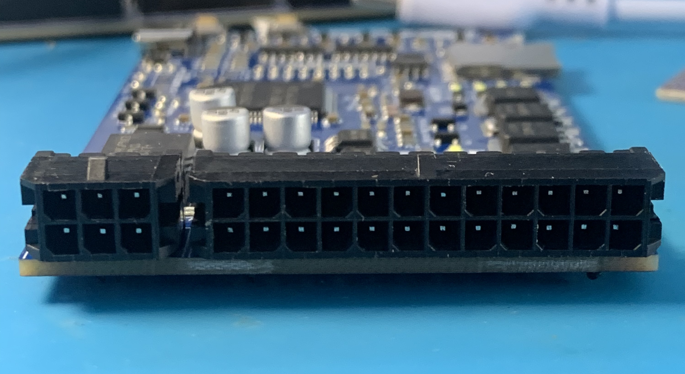

# ECU Mazduino Compact (v1)

## Gambaran Umum

ECU Mazduino Compact v1 adalah unit kontrol mesin standalone 4-channel yang dirancang untuk aplikasi manajemen mesin yang serbaguna. Dibuat khusus untuk firmware rusEFI dan Speeduino, memberikan kontrol mesin komprehensif dalam paket kompak yang cocok untuk operasi 4-silinder sequential penuh atau 8-silinder paired.


## Fitur Utama
- Input trigger utama untuk sensor CKP hall atau optical saja
- Input trigger kedua untuk sensor CMP hall atau optical saja
- 6 input analog (0-5V) untuk MAP, TPS, IAT, CLT, O2, dan 1 cadangan yang dapat digunakan untuk sensor tekanan bahan bakar atau sensor lainnya
- Catu daya 5V untuk sensor dengan perlindungan fuse internal
- 3 input digital pullup untuk AC Switch, VSS, Clutch (AC atau VSS dapat digunakan untuk tombol Launch Control jika tidak diperlukan)
- 5x driver low-side arus tinggi 3A untuk injektor high-impedance dan idle PWM (ISC)
- 5x driver low-side arus rendah untuk relay utama, pompa bahan bakar, kompresor AC, kipas, dan kontrol tachometer
- 4x output 12V atau 5V untuk sinyal koil pengapian
- Prosesor 168 MHz ARM Cortex-M4
- Komunikasi data via CANbus
- Komunikasi data via USB Type-C
- Komunikasi Serial RX/TX
- Konektor 30-pin dengan konfigurasi Microfit 2x12 dan 2x3
- Kartu SD untuk data logging

## Wiring dan Instalasi

### Pin Mapping Konektor

ECU Mazduino Compact menggunakan konektor 30-pin dengan pin assignment sebagai berikut:



#### Layout Konektor
```
 1   2   3       7   8   9  10  11  12  13  14  15  16  17  18
 4   5   6      19  20  21  22  23  24  25  26  27  28  29  30
```

#### Pin Assignment

| Pin | Fungsi | Deskripsi |
|-----|----------|-------------|
| 1 | Clutch | Input posisi kopling |
| 2 | AC Switch | Switch AC/input digital |
| 3 | CANH/Spare Analog 1 | CAN High atau input analog cadangan (solder jumper) |
| 4 | VSS | Sensor kecepatan kendaraan |
| 5 | GND | Ground |
| 6 | CANL/Main Relay | CAN Low atau relay utama (solder jumper) |
| 7 | 12V | Catu daya utama |
| 8 | 5V | Output referensi 5V |
| 9 | Fan | Kontrol relay kipas |
| 10 | Tacho | Output tachometer |
| 11 | Idle PWM | PWM kontrol idle air |
| 12 | Injector 4 | Channel injektor 4 |
| 13 | Injector 3 | Channel injektor 3 |
| 14 | Injector 2 | Channel injektor 2 |
| 15 | Injector 1 | Channel injektor 1 |
| 16 | CMP | Sensor posisi camshaft |
| 17 | TPS | Sensor posisi throttle |
| 18 | MAP | Tekanan absolut manifold |
| 19 | GND | Ground |
| 20 | GND | Ground |
| 21 | AC Compressor | Relay kompresor AC |
| 22 | Fuel Pump | Relay pompa bahan bakar |
| 23 | Ignition 1 | Channel pengapian 1 |
| 24 | Ignition 2 | Channel pengapian 2 |
| 25 | Ignition 3 | Channel pengapian 3 |
| 26 | Ignition 4 | Channel pengapian 4 |
| 27 | CKP | Sensor posisi crankshaft |
| 28 | IAT | Suhu udara masuk |
| 29 | CLT | Suhu coolant |
| 30 | O2 | Sensor oksigen |

### Pin Mapping MCU

Untuk pengguna lanjutan dan pengembangan firmware, berikut adalah pin assignment STM32F407VGT6:

| Fungsi | Pin MCU |
|----------|---------|
| Output Pengapian 1 | PE15 |
| Output Pengapian 2 | PE14 |
| Output Pengapian 3 | PD13 |
| Output Pengapian 4 | PE5 |
| Output Injeksi 1 | PD8 |
| Output Injeksi 2 | PB15 |
| Output Injeksi 3 | PB14 |
| Output Injeksi 4 | PB13 |
| Sensor MAP | PA0 |
| TPS | PA3 |
| Sensor IAT | PA5 |
| Sensor CLT | PA4 |
| Sensor O2 | PA1 |
| Battery/Voltage Ref | PA2 |
| Input Analog Cadangan 1 | PB1 |
| Input AC | PB0 |
| Input Clutch | PE13 |
| VSS | PD7 |
| CKP | PD3 |
| CMP | PD4 |
| Tacho | PC9 |
| Relay Pompa Bahan Bakar | PC8 |
| Relay FAN | PA15 |
| Relay Kompresor AC | PC7 |
| Relay Utama | PE8 |
| Idle 1 | PD9 |
| TXD1 | PA9 |
| RXD1 | PA10 |
| TXD3 | PB10 |
| RXD3 | PB11 |
| TXCAN | PD1 |
| RXCAN | PD0 |
| SD CS | PD2 |
| SPI3 CLK | PC10 |
| SPI3 MISO | PC11 |
| SPI3 MOSI | PC12 |

### Solder Jumper

PCB termasuk solder jumper di bagian belakang untuk konfigurasi:
- **Pin 3**: CANH atau Input Analog Cadangan 1
- **Pin 6**: CANL atau Kontrol Relay Utama
- **Pemilihan tegangan pengapian**: Pilih tegangan yang sesuai untuk koil pengapian

### Langkah Instalasi
1. **Pemasangan**: Amankan ECU di lokasi yang sesuai
2. **Koneksi Daya**: Hubungkan daya utama (pin 7) dan ground (pin 5, 19, 20)
3. **Wiring Sensor**: Hubungkan sensor mesin sesuai pin mapping di atas
4. **Wiring Aktuator**: Hubungkan injektor dan koil pengapian ke pin masing-masing
5. **Verifikasi**: Periksa semua koneksi sebelum power-up

### Catatan Wiring
- **Ground Sensor**: Gunakan pin 19 dan 20 untuk koneksi ground sensor
- **Referensi 5V**: Pin 8 menyediakan referensi 5V untuk sensor
- **Konfigurasi CAN**: Gunakan solder jumper untuk memilih fungsi CAN atau relay (pin 3 & 6)
- **Kompatibilitas Wiring**: Wiring kompatibel dengan standar Speeduino
- **Referensi**: Informasi wiring tambahan tersedia di [Speeduino Wiki](https://wiki.speeduino.com/en/wiring/system)

## Dukungan dan Sumber Daya

### Dokumentasi
- Panduan instalasi - Petunjuk setup lengkap
- Diagram wiring - Pin assignment konektor detail (lihat di atas)
- Panduan tuning - Konfigurasi dan optimisasi mesin
- Pemecahan masalah - Masalah umum dan solusi

### File Firmware & Konfigurasi
- [Halaman Download](downloads.md) - Dapatkan firmware terbaru dan file konfigurasi TunerStudio
- Firmware rusEFI dan Speeduino tersedia