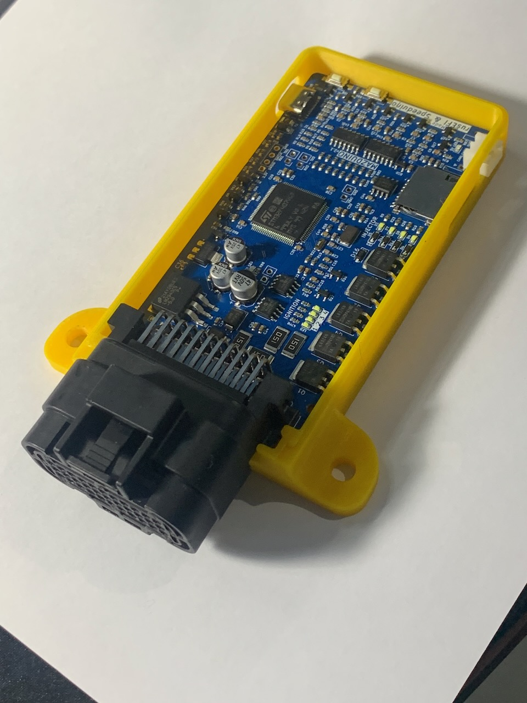
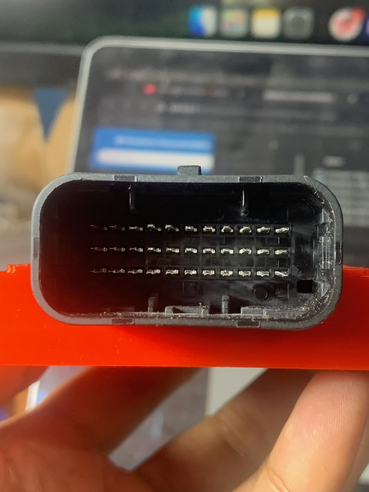

# ECU Mazduino Compact (v2.1)

## Gambaran Umum

ECU Mazduino Compact v2.1 adalah unit kontrol mesin standalone 4-channel yang dirancang untuk aplikasi manajemen mesin yang serbaguna. Dibuat khusus untuk firmware rusEFI dan Speeduino, memberikan kontrol mesin komprehensif dalam paket kompak yang cocok untuk operasi 4-silinder sequential penuh atau 8-silinder paired.

**Fitur Baru v2.1:**

- **Konektor Yamaha 33-pin**: Upgrade dari Microfit ke konektor otomotif grade profesional
- **Knock Sensor Input**: IC khusus untuk membaca sensor knock dan deteksi ketukan mesin
- **6 MOSFET High Current**: Penambahan 1 MOSFET arus tinggi (dari 5 menjadi 6) untuk kontrol Idle 2/Boost/VVT



## Fitur Utama
- Input trigger utama untuk sensor CKP hall atau optical saja
- Input trigger kedua untuk sensor CMP hall atau optical saja
- 6 input analog (0-5V) untuk MAP, TPS, IAT, CLT, O2, dan 1 cadangan yang dapat digunakan untuk sensor tekanan bahan bakar atau sensor lainnya
- **Knock Sensor Input (v2.1)**: Input khusus untuk sensor knock dengan IC conditioning
- Catu daya 5V untuk sensor dengan perlindungan fuse internal
- 3 input digital pullup untuk AC Switch, VSS, Clutch (AC atau VSS dapat digunakan untuk tombol Launch Control jika tidak diperlukan)
- **6x driver low-side arus tinggi 3A (v2.1)**: 4 injektor + Idle 1 + Idle 2 untuk high-impedance injector, idle PWM, boost control, VVT
- 5x driver low-side arus rendah untuk relay utama, pompa bahan bakar, kompresor AC, kipas, dan kontrol tachometer
- 4x output 12V atau 5V untuk sinyal koil pengapian
- Prosesor 168 MHz ARM Cortex-M4
- Komunikasi data via CANbus
- Komunikasi data via USB Type-C
- Komunikasi Serial RX/TX
- **Konektor Yamaha 33-pin (v2.1)**: Konektor otomotif grade profesional dengan pin assignment yang optimal
- Kartu SD untuk data logging

## Wiring dan Instalasi

### Pin Mapping Konektor

ECU Mazduino Compact v2.1 menggunakan konektor Yamaha 33-pin dengan pin assignment sebagai berikut:



#### Layout Konektor
```
11  10   9   8   7   6   5   4   3   2   1
22  21  20  19  18  17  16  15  14  13  12
33  32  31  30  29  28  27  26  25  24  23
```

#### Pin Assignment

| Pin | Fungsi | Deskripsi |
|-----|----------|-------------|
| 1 | Injector 1 | Channel injektor 1 |
| 2 | Injector 2 | Channel injektor 2 |
| 3 | Injector 3 | Channel injektor 3 |
| 4 | Injector 4 | Channel injektor 4 |
| 5 | Idle 1 | Output kontrol idle 1 (high current 3A) |
| 6 | Tacho | Output tachometer |
| 7 | Fan | Kontrol relay kipas |
| 8 | 5V | Output referensi 5V |
| 9 | 12V | Catu daya utama |
| 10 | Main Relay | Kontrol relay utama |
| 11 | GND | Ground |
| 12 | **Idle 2** | **Output kontrol idle 2 (high current 3A) - dapat digunakan untuk boost/VVT** |
| 13 | Ignition 4 | Channel pengapian 4 |
| 14 | Ignition 3 | Channel pengapian 3 |
| 15 | Ignition 2 | Channel pengapian 2 |
| 16 | Ignition 1 | Channel pengapian 1 |
| 17 | Fuel Pump | Kontrol relay pompa bahan bakar |
| 18 | AC Compressor | Relay kompresor AC |
| 19 | CKP | Sensor posisi crankshaft (Trigger 1) |
| 20 | GND | Ground |
| 21 | GND | Ground |
| 22 | GND | Ground |
| 23 | CLT | Suhu coolant |
| 24 | TPS | Sensor posisi throttle |
| 25 | O2 | Sensor oksigen |
| 26 | MAP | Tekanan absolut manifold |
| 27 | IAT | Suhu udara masuk |
| 28 | Spare Analog | Input analog cadangan |
| 29 | CMP | Sensor posisi camshaft (Trigger 2) |
| 30 | **Knock Sensor** | Input sensor knock dengan IC conditioning |
| 31 | AC Switch | Input switch AC (aktif ground) |
| 32 | Clutch | Input posisi kopling |
| 33 | VSS | Sensor kecepatan kendaraan |

### Pin Mapping MCU

Untuk pengguna lanjutan dan pengembangan firmware, berikut adalah pin assignment STM32F407VGT6 untuk v2.1:

| Fungsi | Pin MCU |
|----------|---------|
| Output Pengapian 1 | PE15 |
| Output Pengapian 2 | PE14 |
| Output Pengapian 3 | PD13 |
| Output Pengapian 4 | PE5 |
| Output Injeksi 1 | PD8 |
| Output Injeksi 2 | PB15 |
| Output Injeksi 3 | PB14 |
| Output Injeksi 4 | PB13 |
| Sensor MAP | PA0 |
| TPS | PA3 |
| Sensor IAT | PA5 |
| Sensor CLT | PA4 |
| Sensor O2 | PA1 |
| Battery/Voltage Ref | PA2 |
| Input Analog Cadangan 1 | PB1 |
| **Knock Sensor** | **PA6** |
| Input AC | PB0 |
| Input Clutch | PE13 |
| VSS | PD7 |
| CKP | PD3 |
| CMP | PD4 |
| Tacho | PC9 |
| Relay Pompa Bahan Bakar | PC8 |
| Relay FAN | PA15 |
| Relay Kompresor AC | PC7 |
| Relay Utama | PE8 |
| Idle 1 | PD9 |
| Idle 2 | PD10 |
| TXD1 | PA9 |
| RXD1 | PA10 |
| TXD3 | PB10 |
| RXD3 | PB11 |
| TXCAN | PD1 |
| RXCAN | PD0 |
| SD CS | PD2 |
| SPI3 CLK | PC10 |
| SPI3 MISO | PC11 |
| SPI3 MOSI | PC12 |

### Fitur Khusus v2.1

#### Konektor Yamaha 33-pin (Baru di v2.1)
- **Upgrade Konektor**: Dari Microfit 30-pin ke Yamaha 33-pin otomotif grade
- **Keandalan Tinggi**: Konektor tahan cuaca dan vibration resistant
- **Pin Layout Optimal**: Pin assignment yang lebih terorganisir untuk instalasi yang mudah
- **Ground yang Lebih Baik**: Multiple ground pins (11, 20, 21, 22) untuk integritas sinyal

#### Knock Sensor Support (Baru di v2.1)
- **Pin 30**: Input khusus untuk sensor knock
- **IC Conditioning**: Sirkuit khusus untuk memproses sinyal knock sensor
- **MCU Pin PA6**: Pin khusus untuk input knock sensor
- **Aplikasi**: Deteksi ketukan mesin untuk perlindungan dan optimasi timing

#### Enhanced High Current Outputs (v2.1)
- **6 MOSFET High Current**: Upgrade dari 5 menjadi 6 MOSFET arus tinggi 3A
- **Dual Idle Control**: Idle 1 dan Idle 2 untuk kontrol idle yang lebih presisi
- **Flexible Applications**: Idle 2 dapat digunakan untuk boost control, VVT, atau kontrol PWM lainnya
- **Output Capacity**: Total 6 output arus tinggi vs 5 output di v1

#### Solder Jumper
PCB termasuk solder jumper di bagian belakang untuk konfigurasi:
- **Input/Output Selection**: Konfigurasi pin untuk berbagai fungsi
- **Pemilihan tegangan pengapian**: Pilih tegangan yang sesuai untuk koil pengapian
- **Knock Sensor Enable**: Aktivasi input knock sensor

### Langkah Instalasi
1. **Pemasangan**: Amankan ECU di lokasi yang sesuai dengan akses yang baik untuk konektor
2. **Koneksi Daya**: Hubungkan daya utama (pin 9) dan ground (pin 11, 20, 21, 22)
3. **Wiring Sensor**: Hubungkan sensor mesin sesuai pin mapping di atas
4. **Knock Sensor**: Hubungkan sensor knock ke pin 30 jika digunakan
5. **Wiring Aktuator**: Hubungkan injektor dan koil pengapian ke pin masing-masing
6. **Verifikasi**: Periksa semua koneksi sebelum power-up

### Catatan Wiring
- **Multiple Ground**: Gunakan semua pin ground (11, 20, 21, 22) untuk koneksi yang optimal
- **Referensi 5V**: Pin 8 menyediakan referensi 5V untuk sensor
- **Knock Sensor**: Pin 30 memiliki IC conditioning khusus untuk sinyal knock
- **High Current Outputs**: Pin 1-5 dan 12 adalah output arus tinggi 3A untuk injektor dan kontrol PWM
- **Idle 2 Flexibility**: Pin 12 (Idle 2) dapat digunakan untuk idle control, boost control, VVT, atau kontrol PWM arus tinggi lainnya
- **Konektor Yamaha**: Konektor grade otomotif dengan keandalan tinggi
- **AC Switch**: Pin 31 adalah input aktif ground untuk switch AC
- **Kompatibilitas Wiring**: Kompatibel dengan standar Speeduino dengan pin mapping yang diperbarui
- **Referensi**: Informasi wiring tambahan tersedia di [Speeduino Wiki](https://wiki.speeduino.com/en/wiring/system)

## Perbandingan v1 vs v2.1

| Fitur | v1 | v2.1 |
|--------|-----|------|
| Konektor | Microfit 30-pin (2x12 + 2x3) | Yamaha 33-pin otomotif |
| Knock Input | Tidak ada | Pin 30 dengan IC conditioning |
| Ground Pins | 3 pins (5, 19, 20) | 4 pins (11, 20, 21, 22) |
| Pin Layout | 6-pin dan 24-pin terpisah | 33-pin single connector |
| MCU Pin Knock | - | PA6 |
| **High Current MOSFET** | **5 (4 injektor + 1 idle)** | **6 (4 injektor + 2 idle)** |
| Idle Outputs | 1 (Idle PWM) | 2 (Idle 1 & Idle 2) |

## Dukungan dan Sumber Daya

### Dokumentasi
- Panduan instalasi v2.1 - Petunjuk setup lengkap untuk konektor Yamaha
- Diagram wiring - Pin assignment konektor 33-pin detail (lihat di atas)
- Panduan tuning - Konfigurasi dan optimisasi mesin dengan knock detection
- Panduan knock sensor - Setup dan kalibrasi sensor knock
- Pemecahan masalah - Masalah umum dan solusi untuk v2.1

### File Firmware & Konfigurasi
- [Halaman Download](downloads.md) - Dapatkan firmware terbaru dan file konfigurasi TunerStudio untuk v2.1
- Firmware rusEFI dan Speeduino tersedia dengan dukungan knock sensor
- Konfigurasi pin mapping khusus untuk v2.1 sudah disertakan
- Template konfigurasi knock sensor untuk berbagai jenis mesin

### Support dan Komunitas
- Forum Mazduino untuk pertanyaan teknis v2.1
- Dokumentasi upgrade dari v1 ke v2.1
- Panduan migrasi konfigurasi dan wiring