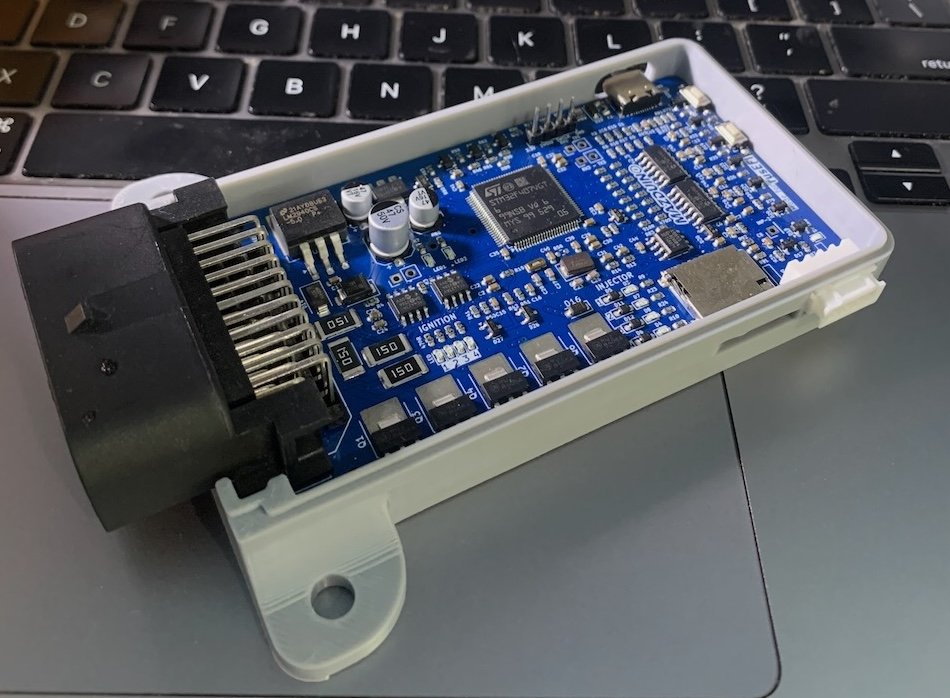
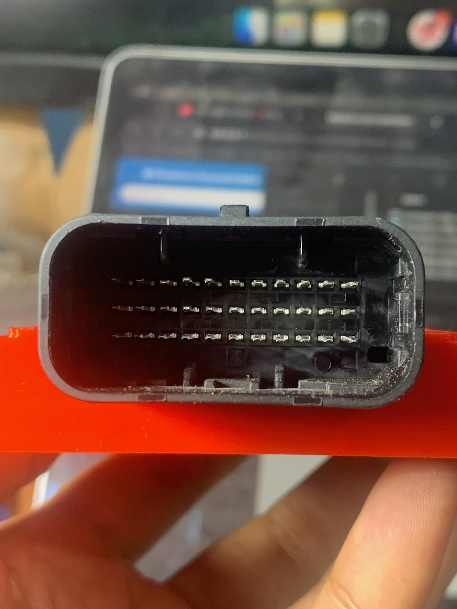

# ECU Mazduino Compact (v2.5)

## Gambaran Umum

ECU Mazduino Compact v2.5 adalah pengembangan terbaru dari platform Compact 4-channel dengan fokus pada peningkatan fleksibilitas output dan kestabilan pembacaan sinyal. Versi ini tetap ditujukan untuk firmware rusEFI dan Speeduino, cocok untuk konfigurasi 4-silinder sequential penuh atau 8-silinder paired.

**Pembaruan v2.5:**

- **Pembaruan Pin Mapping MCU pada High Side**: High side kini menjadi dua kanal independen dengan mapping **HS1 = PD15** dan **HS2 = PD14**
- **Optimasi Hall Input**: Perbaikan jalur dan conditioning input hall (CKP/CMP) untuk sinyal trigger lebih stabil pada rpm rendah maupun tinggi
- **Optimasi Analog Input**: Penyempurnaan filtering analog untuk meningkatkan akurasi pembacaan sensor dan ketahanan terhadap noise
- **PCB Optimization**: Penyempurnaan routing dan konfigurasi jumper untuk fleksibilitas instalasi



## Fitur Utama

### Core Features
- Input trigger utama untuk sensor CKP hall atau optical
- Input trigger kedua untuk sensor CMP hall atau optical
- 6 input analog (0-5V) untuk MAP, TPS, IAT, CLT, O2, dan 1 cadangan
- Input knock sensor khusus dengan conditioning yang kompatibel firmware official
- Catu daya 5V untuk sensor dengan perlindungan fuse internal
- 3 input digital pullup untuk AC Switch, VSS, dan Clutch
- 6x driver low-side arus tinggi 3A: 4 injektor + Idle 1 + Idle 2
- 5x driver low-side arus rendah untuk main relay, fuel pump, AC compressor, fan, dan tacho
- 4x output 12V atau 5V untuk sinyal koil pengapian
- **2x High Side Switching** untuk kontrol alternator, VVT, atau 12V switching tambahan
- Prosesor 168 MHz ARM Cortex-M4
- Komunikasi via CANbus, USB Type-C, dan Serial RX/TX
- Konektor Yamaha 33-pin otomotif grade
- Dukungan data logging SD Card

### Pembaruan High Side (v2.5)
- **HS1 (utama)** menggunakan pin MCU **PD15**
- **HS2 (tambahan)** menggunakan pin MCU **PD14**
- Pada konektor, terdapat opsi **GND / HS2 (Jumper)** untuk menyesuaikan mode pemakaian
- Memungkinkan kontrol beban 12V lebih fleksibel untuk kebutuhan setup lanjutan

### Optimasi Hall Input (v2.5)
- Alokasi pin hall tetap: **CKP = PD3** dan **CMP = PD4**
- Peningkatan dilakukan pada sisi jalur/rangkaian input (tanpa perubahan pin mapping)
- Tujuan optimasi: memperbaiki stabilitas trigger dan mengurangi gangguan noise

### Optimasi Analog Input (v2.5)
- Alokasi pin analog tetap: MAP, TPS, IAT, CLT, O2, dan spare analog tidak berubah
- Perbaikan berada pada filtering dan kualitas conditioning sinyal analog
- Tujuan optimasi: pembacaan sensor lebih konsisten dan akurat

## Wiring dan Instalasi

### Pin Mapping Konektor

ECU Mazduino Compact v2.5 menggunakan konektor Yamaha 33-pin dengan pin assignment sebagai berikut:



#### Layout Konektor
```
11  10   9   8   7   6   5   4   3   2   1
22  21  20  19  18  17  16  15  14  13  12
33  32  31  30  29  28  27  26  25  24  23
```

#### Pin Assignment

| Pin | Fungsi | Deskripsi |
|-----|--------|-----------|
| 1 | Injector 1 | Channel injektor 1 |
| 2 | Injector 2 | Channel injektor 2 |
| 3 | Injector 3 | Channel injektor 3 |
| 4 | Injector 4 | Channel injektor 4 |
| 5 | Idle 1 | Output kontrol idle 1 (high current 3A) |
| 6 | Tacho/RPM | Output tachometer |
| 7 | Fan | Kontrol relay kipas |
| 8 | 5V | Output referensi 5V |
| 9 | 12V | Catu daya utama |
| 10 | Main Relay | Kontrol relay utama |
| 11 | GND | Ground |
| 12 | Idle 2 | Output kontrol idle 2 (high current 3A) |
| 13 | Ignition 4 | Channel pengapian 4 |
| 14 | Ignition 3 | Channel pengapian 3 |
| 15 | Ignition 2 | Channel pengapian 2 |
| 16 | Ignition 1 | Channel pengapian 1 |
| 17 | Fuel Pump | Kontrol relay pompa bahan bakar |
| 18 | AC Compressor Relay | Relay kompresor AC |
| 19 | CKP / Trigger 1 | Sensor posisi crankshaft |
| 20 | GND | Ground |
| **21** | **GND / HS2 (Jumper)** | **Ground atau High Side 2 (sesuai konfigurasi jumper)** |
| **22** | **HS1** | **High Side Output 1** |
| 23 | CLT | Sensor suhu coolant |
| 24 | TPS | Sensor posisi throttle |
| 25 | O2 | Sensor oksigen |
| 26 | MAP | Sensor tekanan manifold |
| 27 | IAT | Sensor suhu udara masuk |
| 28 | Spare Analog Input | Input analog cadangan |
| 29 | CMP / Trigger 2 | Sensor posisi camshaft |
| 30 | Knock Sensor | Input sensor knock |
| 31 | AC Switch Input | Input switch AC (aktif ground) |
| 32 | Clutch Switch | Input posisi kopling |
| 33 | VSS | Sensor kecepatan kendaraan |

### Pin Mapping MCU (v2.5)

Pin mapping MCU untuk STM32F407VGT6 pada v2.5:

| Fungsi | Pin MCU | Perubahan v2.5 |
|--------|---------|----------------|
| Output Pengapian 1 | PE15 | - |
| Output Pengapian 2 | PE14 | - |
| Output Pengapian 3 | PD13 | - |
| Output Pengapian 4 | PE5 | - |
| Output Injeksi 1 | PD8 | - |
| Output Injeksi 2 | PB15 | - |
| Output Injeksi 3 | PB14 | - |
| Output Injeksi 4 | PB13 | - |
| Sensor MAP | PA0 | - |
| TPS | PA6 | Optimasi rangkaian input |
| Sensor IAT | PA5 | Optimasi rangkaian input |
| Sensor CLT | PA4 | Optimasi rangkaian input |
| Sensor O2 | PA1 | Optimasi rangkaian input |
| Battery/Voltage Ref | PA2 | Optimasi rangkaian input |
| Knock Input | PA3 | - |
| Analog Spare Input 1 | PB1 | Optimasi rangkaian input |
| Analog Spare Input 2 | PA7 | Optimasi rangkaian input |
| AC Input | PB0 | - |
| Clutch Input | PE13 | - |
| VSS | PD7 | - |
| CKP | PD3 | Optimasi jalur hall input |
| CMP | PD4 | Optimasi jalur hall input |
| Tacho | PC9 | - |
| Fuelpump Relay | PC8 | - |
| FAN Relay | PA15 | - |
| AC Compressor Relay | PC7 | - |
| Main Relay | PE8 | - |
| Idle 1 | PD9 | - |
| Idle 2 | PD10 | - |
| **High Side Output 1 (HS1)** | **PD15** | **🔄 Pin high side diperbarui** |
| **High Side Output 2 (HS2)** | **PD14** | **🆕 Kanal high side baru** |
| TXD1 | PA9 | - |
| RXD1 | PA10 | - |
| TXD3 | PB10 | - |
| RXD3 | PB11 | - |
| TXCAN | PD1 | - |
| RXCAN | PD0 | - |
| SD CS | PD2 | - |
| SPI3 CLK | PC10 | - |
| SPI3 MISO | PC11 | - |
| SPI3 MOSI | PC12 | - |

## Spesifikasi Teknis

| Parameter | Nilai |
|-----------|-------|
| Input Voltage | 12V (9V - 16V) |
| MCU | STM32F407VGT6 |
| Clock Speed | 168 MHz |
| Flash Memory | 1MB |
| RAM | 192KB |
| Analog Inputs | 7 channels (0-5V) |
| Digital Inputs | 4 channels |
| Ignition Outputs | 4 channels (12V/5V) |
| Low Side MOSFET Outputs | 6 channels (4 Injector + Idle 1 + Idle 2, 3A max) |
| Auxiliary Outputs | 7 channels |
| High Side Output | 2 channels (HS1 + HS2) |
| Communication | USB-C, CAN, Serial |
| Data Logging | SD Card |
| Operating Temp | -40C to +85C |
| Dimensions | 100mm x 80mm |
| Connector | Yamaha 33-pin |
