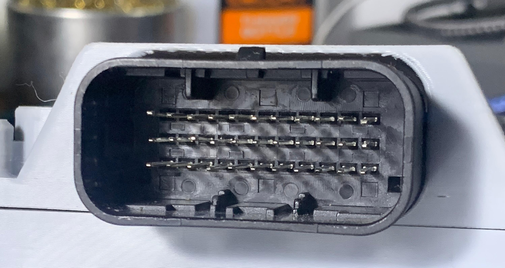

# Mazduino LITE v0.1

## Pengantar

Mazduino LITE v0.1 adalah varian pertama dari keluarga ECU Mazduino LITE yang dirancang khusus untuk aplikasi engine 4-silinder dengan 4 channel injector dan 2 channel ignition. Versi ini ideal untuk setup **Coil On Plug** atau aplikasi dengan **IGBT Eksternal**.


**Catatan Penting v0.1**: 

- IGBT footprint tidak umum - gunakan IGBT eksternal atau Coil On Plug

## Fitur Utama

### Sistem Input
- **Trigger Input**: CKP dan CMP untuk Hall/Optical sensors
- **VR Support**: Variable Reluctance sensors dengan konditioner module
- **Analog Inputs**: 6x (0-5V) untuk MAP, TPS, IAT, CLT, O2, dan spare
- **Digital Inputs**: 5x pullup untuk AC Switch, VSS, Clutch, dan launch control
- **Sensor Power**: 5V regulated dengan internal fuse protection

### Sistem Output
- **Injection**: 4x high-current drivers untuk sequential atau batch mode
- **Ignition**: 2x outputs dengan Smart Coil (5V/12V) support
  - **v0.1**: IGBT footprint tidak umum - **gunakan IGBT eksternal atau COP**
- **Control**: 5x relay outputs untuk fuel pump, fan, AC, main relay, tachometer
- **Idle Control**: 2x PWM outputs untuk ISC valve

### Komunikasi
- **USB Type-C**: Modern connector untuk tuning dan programming
- **CAN Bus**: 4-pin connector dengan power selection (5V/12V)
- **Serial**: RX/TX pins untuk additional communication

### Penyimpanan dan Timing
- **SD Card**: Micro SD untuk onboard data logging (max 32GB)
- **RTC**: Battery-backed real-time clock
- **Processor**: ARM Cortex-M4 STM32F4 series

## Sistem Konektor

### Konektor Utama 33-Pin



#### Layout Konektor
```
11  10   9   8   7   6   5   4   3   2   1
22  21  20  19  18  17  16  15  14  13  12
33  32  31  30  29  28  27  26  25  24  23
```

#### Pin Assignment v0.1

| Pin | Fungsi | Deskripsi |
|-----|----------|-------------|
| 1 | Idle 1 | Output kontrol idle 1 |
| 2 | Idle 2 | Output kontrol idle 2 |
| 3 | CKP/Digital1 | Crankshaft position |
| 4 | VR1- | VR sensor negatif |
| 5 | Ignition 1 | Channel pengapian 1 |
| 6 | Main Relay | Kontrol relay utama |
| 7 | **Ignition 2** | **Channel pengapian 2** |
| 8 | Tacho/RPM | Output tachometer |
| 9 | **Ground Coil** | **Ground untuk coil** |
| 10 | +5V | Output referensi 5V |
| 11 | +12V | Catu daya utama |
| 12 | Injector 3 | Channel injektor 3 |
| 13 | Injector 4 | Channel injektor 4 |
| 14 | CMP/Digital2 | Camshaft position |
| 15 | VR2- | VR sensor negatif 2 |
| 16 | VR2+ | VR sensor positif 2 |
| 17 | AC Relay | Kontrol relay AC |
| 18 | Fuel Pump Relay | Kontrol pompa bahan bakar |
| 19 | Fan Relay | Kontrol relay kipas |
| 20 | IAT | Intake air temperature |
| 21 | TPS | Throttle position sensor |
| 22 | Ground ECU | Ground ECU |
| 23 | Injector 2 | Channel injektor 2 |
| 24 | Injector 1 | Channel injektor 1 |
| 25 | Ground Sensor | Ground sensor |
| 26 | Ground Sensor | Ground sensor |
| 27 | VR1+ | VR sensor positif 1 |
| 28 | MAP | Manifold absolute pressure |
| 29 | Clutch/Digital3 | Input posisi kopling |
| 30 | CLT | Coolant temperature |
| 31 | AC Switch Input | Input switch AC (Aktif Ground) |
| 32 | VSS/Digital4 | Vehicle speed sensor |
| 33 | O2 Sensor | Sensor oksigen |

**Penting**: Pin 7 dan 9 pada v0.1 adalah **Ignition 2** dan **Ground Coil**

### CAN Bus Konektor (4-Pin)

| Pin | Fungsi |
|-----|----------|
| 1 | Power (12V/5V selectable) |
| 2 | CAN Low |
| 3 | CAN High |
| 4 | Ground |

## Pin Mapping MCU

Untuk pengguna lanjutan dan pengembangan firmware:

| Fungsi | Pin MCU |
|----------|---------|
| Ignition Output 1 | PE15 |
| Ignition Output 2 | PE14 |
| Injection Output 1 | PD8 |
| Injection Output 2 | PB15 |
| Injection Output 3 | PB14 |
| Injection Output 4 | PB13 |
| MAP Sensor | PA0 |
| TPS | PA3 |
| IAT Sensor | PA5 |
| CLT Sensor | PA4 |
| O2 Sensor | PA1 |
| Battery/Voltage Reff | PA2 |
| Analog Spare Input 1 | PB1 |
| AC Input | PB0 |
| Clutch Input | PE13 |
| VSS | PD7 |
| CKP | PC6 |
| CMP | PE11 |
| VR1 | PD3 |
| VR2 | PD4 |
| Tacho | PC9 |
| Fuelpump Relay | PC8 |
| FAN Relay | PA15 |
| AC Compresor Relay | PC7 |
| Main Relay | PE8 |
| Idle 1 | PD9 |
| Idle 2 | PD10 |
| TXD1 | PA9 |
| RXD1 | PA10 |
| TXD3 | PB10 |
| RXD3 | PB11 |
| TXCAN | PD1 |
| RXCAN | PD0 |
| SD CS | PD2 |
| SPI3 CLK | PC10 |
| SPI3 MISO | PC11 |
| SPI3 MOSI | PC12 |

## Konfigurasi Hardware

### Pengaturan Jumper Kritis

**PENTING**: Konfigurasi jumper harus benar sebelum power-up!

#### Top Side Board
- **Coil Voltage**: 12V/5V selection (default berdasarkan coil type)
- **CAN Terminator**: Enable/disable resistor terminator
- **VR Conditioner**: 8-pin connector untuk VR module

#### Bottom Side Board
- **Tacho Signal**: 5V/12V output selection (default 12V)
- **IGN1/IGN2 Mode**: Smart Coil selection (JP3/JP4)
  - **v0.1**: **Hanya gunakan Smart Coil** - IGBT footprint tidak umum
- **VR1/Hall, VR2/Hall**: Input type selection
- **Digital Pullup**: Enable internal pullup resistors
- **CAN Power**: 12V/5V pada CAN connector

### Peringatan Keselamatan

**PERINGATAN**:

- **Jangan hubungkan sinyal 12V langsung ke ECU input**
- **Verifikasi coil voltage jumper sebelum koneksi**
- **Gunakan sensor ground terpisah dari power ground**
- **Check all jumper settings sebelum first power-up**
---