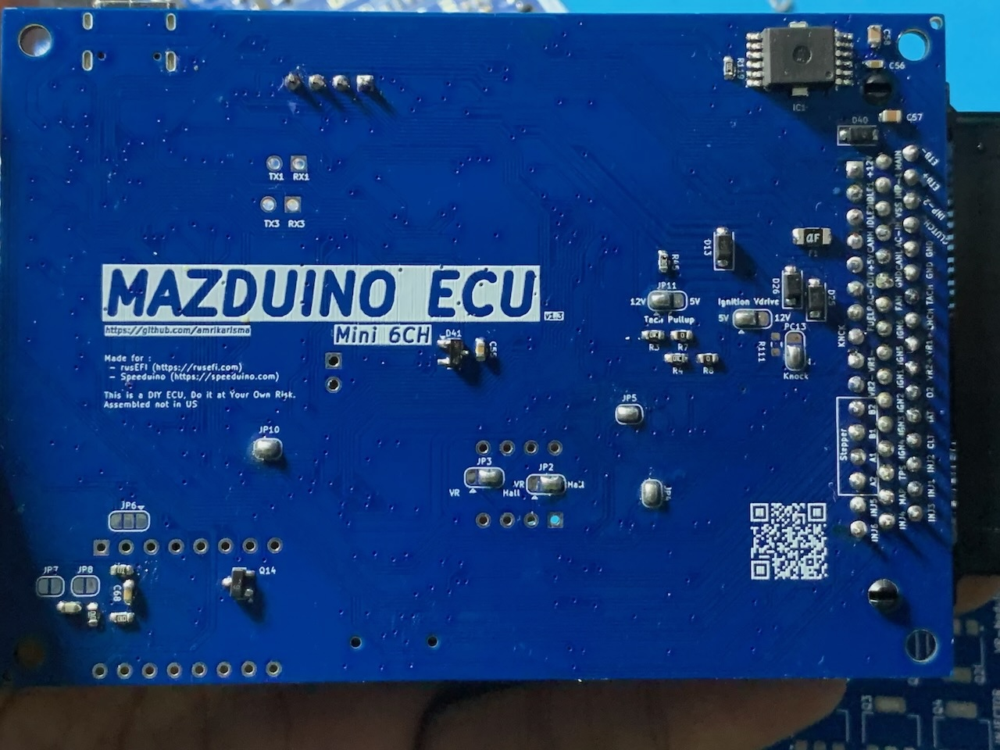
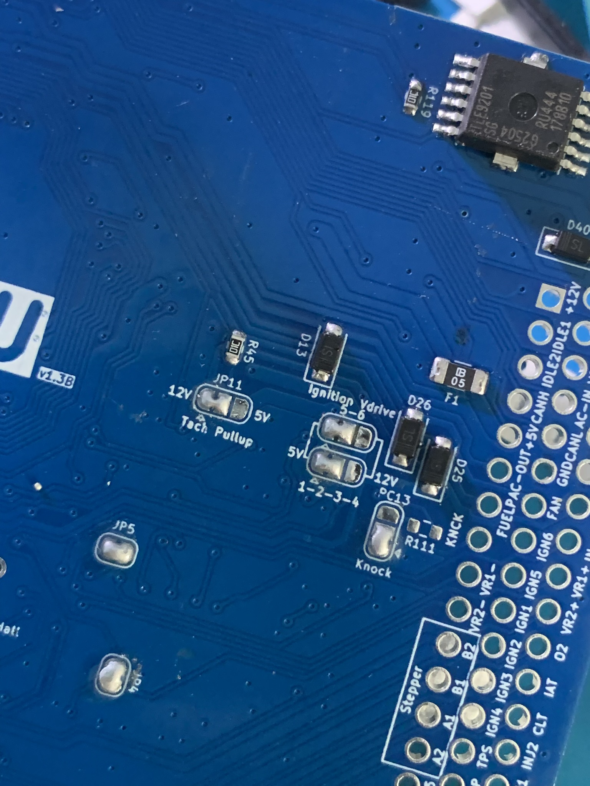
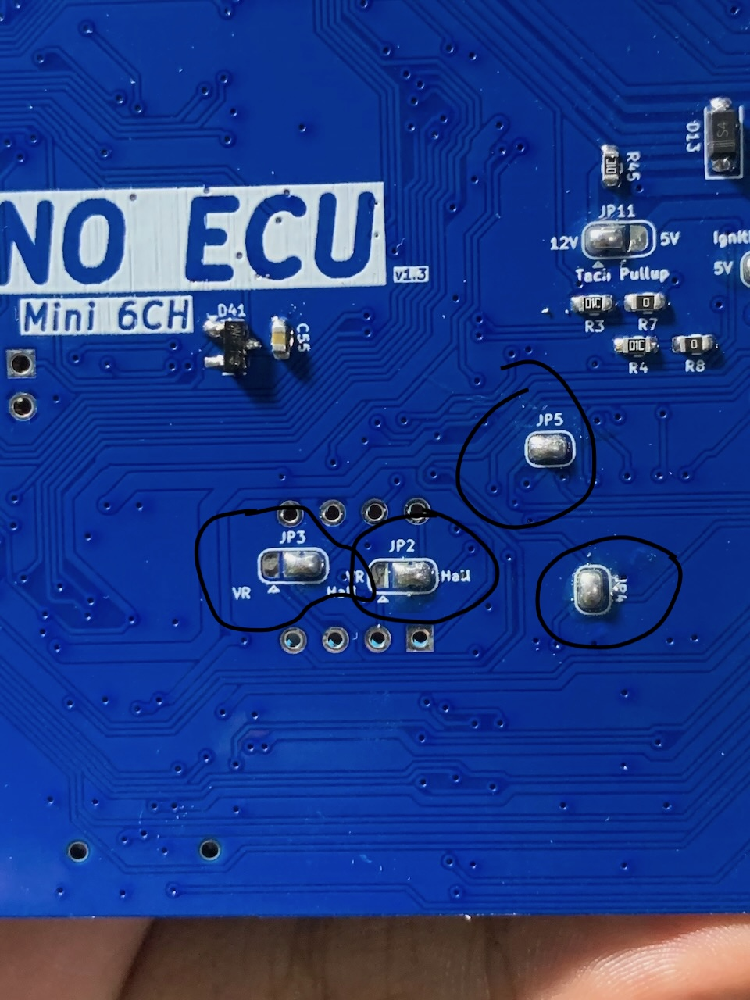

# Mazduino Mini 6CH (v1.3B)

## Gambaran Umum

Mazduino Mini 6CH v1.3B adalah perbaikan dan peningkatan dari versi v1.3, dirancang sebagai Engine Control Unit 6-channel yang lebih optimal. Dibangun di sekitar prosesor **STM32F427VGT6** ARM 32-bit yang lebih powerful, memberikan manajemen mesin komprehensif dalam faktor bentuk kompak yang cocok untuk mesin 6-silinder atau mesin 4-silinder dengan output arus tinggi tambahan.

**Perbaikan v1.3B dari v1.3:**
- **Upgrade MCU**: Menggunakan STM32F427VGT6 (180MHz) yang lebih powerful menggantikan STM32F407VGT6 (168MHz)
- **Penambahan Input Analog**: Menambahkan 1 spare input analog khusus untuk sensor TPS2 yang dibutuhkan untuk ETB
- **Optimisasi Hardware**: Menghapus dan mengoptimalkan komponen yang tidak digunakan untuk efisiensi yang lebih baik
- **Layout Komponen**: Menata ulang layout komponen untuk kinerja dan manufaktur yang lebih optimal
- **Dukungan ETB yang Diperbaiki**: Electronic Throttle Body support dengan input analog TPS2 yang dedicated
- **Efisiensi Desain**: Desain yang lebih streamlined dengan fokus pada fungsionalitas yang diperlukan


## Fitur Utama
- Input trigger utama untuk sensor CKP VR, hall atau optical
- Input trigger kedua untuk sensor CMP VR, hall atau optical
- 8 input analog (0-5V) untuk MAP, TPS, IAT, CLT, O2, dan 3 cadangan termasuk input analog khusus untuk TPS2/ETB yang dapat digunakan untuk sensor tekanan bahan bakar atau sensor lainnya
- Catu daya 5V untuk sensor dengan perlindungan fuse internal
- 4 input digital pullup untuk AC Switch, VSS, Clutch, Launch Control
- 8x driver low-side arus tinggi 3A untuk injektor high-impedance, idle PWM (ISC), Boost, VVT dan lainnya
- 5x driver low-side arus rendah untuk relay utama, pompa bahan bakar, kompresor AC, kipas, dan kontrol tachometer
- 6x output 12V atau 5V untuk sinyal koil pengapian
- **Knock Input (v1.3B)**: Input sensor knock yang diperbaiki untuk deteksi ketukan mesin
- **ETB Support (v1.3B)**: Kontrol Electronic Throttle Body yang dioptimalkan dengan TPS1 dan TPS2
- Dukungan untuk Modul VR Conditioner tambahan
- Dukungan untuk Modul Stepper Idle tambahan
- **Prosesor 180 MHz ARM Cortex-M4 (STM32F427VGT6)** - **Upgrade dari v1.3**
- Komunikasi data via CANbus
- Komunikasi data via USB Type-C
- Komunikasi Serial RX/TX
- Konektor otomotif 48-pin
- Kartu SD untuk data logging


## ⚙️ Konfigurasi Jumper

Mazduino Mini 6CH v1.3B dilengkapi dengan sistem jumper solder yang memungkinkan kustomisasi fungsi sesuai kebutuhan aplikasi Anda. Jumper ini memberikan fleksibilitas konfigurasi tanpa perlu mengubah firmware, memastikan kompatibilitas optimal dengan berbagai setup mesin.



### 🔌 Zona Konfigurasi Atas (Kanan)

#### JP11 - Tachometer Pullup
- **Fungsi**: Menentukan tegangan sinyal output tachometer
- **Pilihan**: 12V atau 5V
- **Aplikasi**: Sesuaikan dengan kompatibilitas dashboard kendaraan Anda

#### Ignition VDrive Jumper
- **Fungsi**: Mengatur tegangan sinyal pengapian untuk **Smart Coil Only**
- **Pilihan**: Sinyal 12V atau 5V
- **Khusus Smart Coil**: Jumper ini hanya untuk smart coil dengan driver internal
- **⚠️ PENTING**: Dump coil memerlukan IGBT eksternal 

#### Knock/PC13 Input Selection
- **Mode Knock**: Input sensor knock untuk deteksi ketukan mesin (default)
- **Mode PC13**: Akses langsung ke pin MCU untuk fungsi custom
- **Perbaikan v1.3B**: Deteksi knock yang lebih stabil dan akurat



### 🎛️ Zona Konfigurasi Tengah

#### JP5 & JP4 - Sensor Pullup Configuration
- **JP5**: Pullup 5V untuk sinyal CKP (Crankshaft Position)
- **JP4**: Pullup 5V untuk sinyal CMP (Camshaft Position)
- **Manfaat**: Sinyal trigger yang bersih dan stabil

#### JP3 & JP2 - Sensor Type Selection
- **JP3**: Mode sinyal CKP (VR atau Hall sensor)
- **JP2**: Mode sinyal CMP (VR atau Hall sensor)
- **Fleksibilitas**: Kompatibel dengan berbagai jenis sensor posisi



### 🌐 Zona Konfigurasi Kiri

#### JP6 - Stepper Motor Enable
- **Fungsi**: Kontrol aktivasi driver stepper motor
- **Note**: Konsultasi skematik untuk konfigurasi optimal
- **Aplikasi**: Idle Air Control (IAC) dengan presisi tinggi

#### JP7 & JP8 - Knock Sensor Filter Bypass
- **Fungsi**: Bypass filter internal untuk sensor knock
- **JP7**: Bypass filter internal knock stage 1
- **JP8**: Bypass filter internal knock stage 2
- **v1.3B Improvement**: Filter yang dioptimalkan untuk sensitivitas deteksi knock
- **Note**: Untuk satu input knock di konektor ECU (pin 8)


### 💡 Tips Konfigurasi Jumper

#### ⚡ Pengaturan Optimal:
- **Smart Coils**: Gunakan VDrive 5V untuk Coil dengan sinyal 5V dan 12V untuk coil dengan sinyal 12V
- **Dump/Conventional Coils**: Memerlukan IGBT eksternal
- **VR Sensors**: Aktifkan pullup dan pilih mode VR untuk sinyal bersih
- **Hall Sensors**: Nonaktifkan pullup dan pilih mode Hall

#### 🔧 Best Practices:
1. **Pre-Installation**: Konfigurasi jumper sebelum instalasi final
2. **Documentation**: Catat konfigurasi jumper untuk referensi masa depan
3. **Testing**: Verifikasi sinyal setelah perubahan konfigurasi jumper
4. **Compatibility**: Pastikan jumper sesuai dengan hardware yang digunakan

#### ⚠️ Perhatian Khusus:
- **Jenis Coil Kritis**: VDrive hanya untuk smart coil - dump coil butuh IGBT eksternal
- **Solder dengan Hati-hati**: Gunakan suhu solder yang tepat
- **Verifikasi Koneksi**: Pastikan sambungan solder yang solid
- **Konsultasi Skematik**: Rujuk diagram untuk konfigurasi lanjutan
- **Power Off**: Selalu matikan power saat mengubah jumper


## Wiring dan Instalasi

### Pin Mapping Konektor

Mazduino Mini 6CH v1.3B menggunakan konektor ECU Yamaha 48-pin dengan pin assignment yang diperbaiki sebagai berikut:


#### Layout Konektor
```
 1   2   3   4   5   6   7   8   9  10  11  12  13  14  15  16
17  18  19  20  21  22  23  24  25  26  27  28  29  30  31  32
33  34  35  36  37  38  39  40  41  42  43  44  45  46  47  48
```

#### Pin Assignment (v1.3B)

| Pin | Fungsi | Deskripsi |
|-----|----------|-------------|
| 1 | 12V ECU | Catu daya utama ECU |
| 2 | IDLE1 | Output kontrol idle 1 |
| 3 | IDLE2 | Output kontrol idle 2 |
| 4 | CANH | CAN bus high |
| 5 | 5V | Output referensi 5V |
| 6 | AC-OUT / AC COMPRESOR | Kontrol kompresor AC |
| 7 | FUEL PUMP | Kontrol relay pompa bahan bakar |
| 8 | **Knock/PC13** | Input sensor knock (default) atau akses pin MCU langsung |
| 9 | VR1- | Input VR conditioner 1 negatif |
| 10 | VR2- | Input VR conditioner 2 negatif |
| 11 | Stepper B2 | Motor stepper fase B2 |
| 12 | Stepper B1 | Motor stepper fase B1 |
| 13 | Stepper A1 | Motor stepper fase A1 |
| 14 | Stepper A2 | Motor stepper fase A2 |
| 15 | Injector 5 | Injektor 5 atau output arus tinggi cadangan |
| 16 | Injector 6 | Injektor 6 atau output arus tinggi cadangan |
| 17 | Main Relay | Kontrol relay utama (low current low side) |
| 18 | **Spare Analog Input 1 / PPS1** | Input analog cadangan 1 atau Pedal Position Sensor 1 untuk ETB |
| 19 | VSS | Vehicle Speed Sensor |
| 20 | **AC-IN / AC Switch** | Input switch AC (Hanya menerima **GROUND** sebagai sinyal ON) |
| 21 | CANL | CAN bus low |
| 22 | **GND** | Ground ECU |
| 23 | FAN | Kontrol relay kipas |
| 24 | Ignition 6 | Channel pengapian 6 |
| 25 | Ignition 5 | Channel pengapian 5 |
| 26 | Ignition 1 | Channel pengapian 1 |
| 27 | Ignition 2 | Channel pengapian 2 |
| 28 | Ignition 3 | Channel pengapian 3 |
| 29 | Ignition 4 | Channel pengapian 4 |
| 30 | TPS | Sensor posisi throttle |
| 31 | MAP | Tekanan absolut manifold |
| 32 | Injector 4 | Channel injektor 4 |
| 33 | **ETB-** | Electronic Throttle Body negatif |
| 34 | **ETB+** | Electronic Throttle Body positif |
| 35 | **Spare Analog Input 2 / PPS2** | Input analog cadangan 2 atau Pedal Position Sensor 2 untuk ETB |
| 36 | Clutch | Input posisi kopling |
| 37 | **GND Sensor** | Ground sensor |
| 38 | **GND Sensor** | Ground sensor |
| 39 | **RPM / Tacho** | Output tachometer |
| 40 | **Spare Input 3 / TPS2** | Input cadangan 3 atau TPS2 untuk ETB |
| 41 | VR1+ | Sensor VR 1 positif |
| 42 | VR2+ | Sensor VR 2 positif |
| 43 | **O2** | Sensor oksigen (analog 5V, dari wideband controller analog output 1-5V) |
| 44 | IAT | Suhu udara masuk |
| 45 | CLT | Suhu coolant |
| 46 | Injector 2 | Channel injektor 2 |
| 47 | Injector 1 | Channel injektor 1 |
| 48 | Injector 3 | Channel injektor 3 |

### Pin Mapping MCU (v1.3B)

Pin assignment **STM32F427VGT6** yang telah diperbaiki untuk v1.3B:

| Function | MCU Pin |
|----------|---------|
| Ignition Output 1 | PE15 |
| Ignition Output 2 | PE14 |
| Ignition Output 3 | PD13 |
| Ignition Output 4 | PE5 |
| Ignition Output 5 | PE2 |
| Ignition Output 6 | PE3 |
| Injection Output 1 | PD8 |
| Injection Output 2 | PB15 |
| Injection Output 3 | PB14 |
| Injection Output 4 | PB13 |
| Injection Output 5 | PD9 |
| Injection Output 6 | PE8 |
| MAP Sensor | PA0 |
| TPS | PA3 |
| IAT Sensor | PA5 |
| CLT Sensor | PA4 |
| O2 Sensor | PA1 |
| Battery/Voltage Reff | PA6 |
| Analog Spare Input 1 | PB0 |
| Analog Spare Input 2 | PB1 |
| **Analog Spare Input 3** | **PA2** |
| AC Input | PB5 |
| Clutch Input | PE12 |
| VSS | PD7 |
| CKP | PD3 |
| CMP | PD4 |
| Tacho | PC9 |
| Fuelpump Relay | PC8 |
| FAN Relay | PA15 |
| AC Compresor Relay | PC7 |
| Main Relay | PC5 |
| Idle 1 | PD10 |
| Idle 2 | PE9 |
| Stepper DIR | PD12 |
| Stepper ENBL | PD14 |
| Stepper STEP | PD15 |
| **Knock1** | **PC0** |
| **Knock2** | **PC1** |
| **ETB-DIR** | **PB8** |
| **ETB-DIS** | **PB9** |
| **ETB-PWM** | **PA8** |
| TXD1 | PA9 |
| RXD1 | PA10 |
| TXD3 | PB10 |
| RXD3 | PB11 |
| TXCAN | PD1 |
| RXCAN | PD0 |
| SD CS | PD2 |
| SPI3 CLK | PC10 |
| SPI3 MISO | PC11 |
| SPI3 MOSI | PC12 |

### Fitur Khusus v1.3B

#### Knock Input (Diperbaiki di v1.3B)
- **Pin 8 (Knock/PC13)**: Input sensor knock dengan solder jumper default untuk deteksi ketukan yang lebih akurat
- **Single Knock Input**: Satu input knock (PC0) di konektor ECU untuk monitoring ketukan mesin
- **Aplikasi**: Deteksi ketukan mesin yang lebih sensitif untuk perlindungan dan optimasi timing pengapian
- **Perbaikan**: Filter dan sensitivitas yang dioptimalkan

#### Electronic Throttle Body (Dioptimalkan di v1.3B)
- **Pin 33 (ETB-)**: Output negatif untuk kontrol ETB
- **Pin 34 (ETB+)**: Output positif untuk kontrol ETB
- **Pin 40 (TPS2)**: Input analog khusus untuk sensor TPS2 yang dedicated untuk ETB - **Fitur baru v1.3B**
- **Pin 18/35 (PPS1/PPS2)**: Dual Pedal Position Sensor untuk kontrol ETB
- **ETB Control**: PWM (PA8), Direction (PB8), Disable (PB9)
- **Perbaikan v1.3B**: Penambahan input analog dedicated untuk TPS2 dan optimisasi hardware ETB

#### Perbaikan Hardware v1.3B
- **Input Analog Tambahan**: Penambahan 1 input analog khusus untuk sensor TPS2/ETB pada pin 40
- **Optimisasi Komponen**: Penghapusan komponen yang tidak digunakan untuk efisiensi desain
- **Layout Komponen**: Penataan ulang layout untuk manufaktur dan kinerja yang lebih optimal
- **Pin 43**: Khusus untuk O2 sensor dengan path analog yang dioptimalkan
- **AC Switch**: Clarification bahwa hanya menerima sinyal GROUND untuk ON

#### Dukungan VR Conditioner
- **VR1- & VR2-**: Pin input untuk modul VR conditioner (DIP 8) - negatif
- **VR1+ & VR2+**: Input sensor VR positif

#### Kontrol Stepper Motor
- **Stepper A1/A2**: Output fase A untuk stepper motor (DRV8825)
- **Stepper B1/B2**: Output fase B untuk stepper motor
- **Direction/Enable/Step**: Sinyal kontrol untuk driver stepper

#### Konfigurasi Injector Fleksibel
Untuk mesin 4-silinder:
- **Injector 5 & 6**: Dapat digunakan sebagai output arus tinggi cadangan
- **Aplikasi**: Kontrol boost, kontrol VVT, injeksi air/methanol, dll.

### Panduan Instalasi
1. **Pemasangan**: Pasang ECU di lokasi yang tepat dengan pendinginan yang memadai
2. **Koneksi Daya**: Hubungkan daya 12V (pin 1) dan ground (pin 22)
3. **Ground Sensor**: Gunakan beberapa pin ground sensor (37, 38) untuk sinyal yang bersih
4. **Sensor Posisi Mesin**: Hubungkan sensor CKP/CMP atau gunakan input VR sesuai kebutuhan
5. **Knock Sensor**: Hubungkan sensor knock ke pin 8 (default konfigurasi)
6. **ETB Setup**: Hubungkan ETB ke pin 33/34 dan TPS2 ke pin 40 (diperbaiki dari v1.3) jika menggunakan throttle elektronik
7. **AC Switch**: Pastikan switch AC hanya memberikan sinyal GROUND untuk kondisi ON
8. **Instalasi Modul**: Pasang modul VR-Conditioner dan/atau Stepper jika diperlukan
9. **Verifikasi**: Test semua koneksi sebelum startup awal

### Catatan Wiring v1.3B
- **Multiple Ground**: Gunakan semua pin ground yang tersedia untuk integritas sinyal optimal
- **Referensi 5V**: Pin 5 menyediakan referensi 5V untuk sensor yang memerlukannya
- **O2 Sensor**: Pin 43 khusus untuk O2 sensor dengan path analog yang dioptimalkan (1-5V dari wideband controller)
- **TPS2 Dedicated**: Pin 40 adalah input analog tambahan khusus untuk sensor TPS2/ETB - **fitur baru v1.3B**
- **Layout Optimization**: Penataan komponen yang lebih baik menghasilkan sinyal yang lebih bersih
- **AC Switch Logic**: Pin 20 hanya menerima GROUND sebagai sinyal ON - jangan hubungkan 12V langsung
- **Sensor VR**: Dapat menggunakan input digital atau input modul VR conditioner
- **Knock Sensor**: Pin 8 dikonfigurasi default untuk knock input dengan filter yang diperbaiki
- **ETB Wiring**: ETB memerlukan koneksi dual (pin 33/34) dan dual TPS (pin 30/40)
- **Konektor Yamaha**: Konektor 48-pin grade otomotif profesional
- **Kompatibilitas Wiring**: Kompatibel dengan standar wiring Speeduino
- **Referensi**: Informasi wiring sensor tambahan di [Speeduino Wiki](https://wiki.speeduino.com/en/wiring/system)

### Perbedaan dari v1.3
#### Hardware Improvements:
- **MCU Upgrade**: Upgrade dari STM32F407VGT6 (168MHz) ke **STM32F427VGT6 (180MHz)** untuk performa lebih tinggi
- **Input Analog Tambahan**: Penambahan 1 spare input analog khusus untuk TPS2/ETB pada pin 40
- **Optimisasi Komponen**: Penghapusan dan optimisasi komponen yang tidak digunakan untuk efisiensi
- **Layout Redesign**: Penataan ulang layout komponen untuk manufaktur dan performa yang lebih baik
- **Pin 43**: Sekarang khusus O2 sensor dengan path yang dioptimalkan

#### Functional Improvements:
- **ETB Support**: Dukungan ETB yang lebih baik dengan input analog TPS2 yang dedicated
- **Hardware Efficiency**: Desain yang lebih streamlined dengan fokus pada komponen yang diperlukan
- **Manufacturing**: Layout yang lebih optimal untuk proses produksi

## Informasi Hardware

Mazduino Mini 6CH v1.3B didesain dengan **STM32F427VGT6** sebagai MCU utama, memberikan performa yang lebih tinggi dibanding v1.3. Mendukung beberapa module tambahan seperti VR Conditioner Module dan Idle Stepper Module. Secara bawaan Mazduino Mini 6CH v1.3B hanya mendukung sinyal CKP dan CMP dalam bentuk digital, seperti sensor hall dan optical. Untuk kendaraan yang masih menggunakan VR sensor perlu menambahkan VR Module (atau bisa custom sensor ke hall).


Kemudian untuk bagian Idle, Mazduino Mini 6CH v1.3B sudah support Idle PWM, terdapat 2 output dari low side mosfet yang dapat digunakan untuk kontrol IDLE PWM.

Untuk jenis Idle Control yang menggunakan stepper motor diperlukan module tambahan yaitu Idle Stepper Motor Module. Disini bisa menggunakan driver DRV8825.


Selain itu terdapat solder jumper di bagian belakang seperti Tach Pullup, Ignition Vdrive, opsi knock / MCU PC13. Kemudian ada JP4, JP5, JP2, JP3, JP6, JP7 dan JP8 yang sudah dijelaskan di bagian konfigurasi jumper.

**Solder Jumper v1.3B:**
- **Tach Pullup:** Pullup untuk tachometer/RPM Speedometer menggunakan 12V atau 5V
- **Ignition Vdrive:** Tegangan yang digunakan untuk mengirimkan sinyal ke Coil On Plug (12V atau 5V)
- **Knock/MCU PC13:** Opsi input Knock sensor atau langsung ke pin MCU PC13 (default untuk Knock)
- **JP4:** Pullup trigger CKP/Primary
- **JP5:** Pullup trigger CMP/Secondary
- **JP2:** Opsi VR atau Hall untuk CKP/Primary
- **JP3:** Opsi VR atau Hall untuk CMP/Secondary
- **JP6:** Bypass Idle Stepper
- **JP7 & JP8:** Bypass filter knock (diperbaiki di v1.3B)
- **Pullup Launch:** Digunakan untuk pullup pada pin spare input 3 jika digunakan untuk tombol aktivasi launch control/input lainnya yang membutuhkan pullup

## Software Tuning

### Download Software
Download software TunerStudio: [https://www.tunerstudio.com/index.php/downloads](https://www.tunerstudio.com/index.php/downloads)


### Konfigurasi Khusus v1.3B
- **Knock Detection**: Gunakan konfigurasi knock sensor yang dioptimalkan untuk v1.3B
- **ETB Setup**: Konfigurasi TPS2 pada pin 40 (bukan pin 43 seperti v1.3)
- **AC Switch Logic**: Pastikan konfigurasi AC switch menggunakan logic GROUND untuk ON
- **Pin Mapping**: Gunakan file konfigurasi pin mapping khusus v1.3B

### Firmware Support
- **rusEFI**: Dukungan penuh untuk v1.3B dengan pin mapping yang diperbaiki
- **Speeduino**: Kompatibel dengan konfigurasi pin mapping terbaru
- **File Konfigurasi**: Tersedia di [halaman download](downloads.md)

## Wiring Diagram

### Wiring Sensor


*Catatan: Pastikan AC Switch hanya menggunakan sinyal GROUND untuk kondisi ON*

### Injector Wiring


### Ignition Wiring


## Dukungan dan Sumber Daya

### Dokumentasi
- **Datasheet STM32F427VGT6**: Informasi lengkap tentang MCU yang diupgrade untuk performa lebih tinggi
- **Manual v1.3B**: Dokumentasi lengkap pin mapping dan perbaikan dari v1.3
- **Wiring Diagram**: Diagram lengkap untuk instalasi dengan perbaikan v1.3B
- **TunerStudio Configuration**: File konfigurasi siap pakai untuk Speeduino dan rusEFI khusus v1.3B
- **Migration Guide**: Panduan migrasi dari v1.3 ke v1.3B

### File Firmware & Konfigurasi
- **[Halaman Download](downloads.md)** - Dapatkan firmware rusEFI terbaru dan file konfigurasi TunerStudio untuk v1.3B
- Dukungan penuh 6-channel dengan fitur-fitur yang diperbaiki
- Konfigurasi pin mapping khusus untuk v1.3B sudah disertakan
- Kompatibel dengan firmware rusEFI dan Speeduino
- **Dukungan Knock yang Diperbaiki**: Konfigurasi khusus untuk sensor knock yang lebih akurat
- **Dukungan ETB yang Dioptimalkan**: Konfigurasi siap pakai untuk Electronic Throttle Body

### Informasi Tambahan
- **Info Firmware rusEFI**: [https://wiki.rusefi.com](https://wiki.rusefi.com)
- **Info Mazduino ECU**: [https://www.mazduino.com](https://www.mazduino.com)
- **Dokumentasi Mazduino**: [https://wiki.mazduino.com](https://wiki.mazduino.com)

## Catatan Penting v1.3B

### Perbedaan Utama dari v1.3
1. **Upgrade MCU**: Menggunakan **STM32F427VGT6 (180MHz)** menggantikan STM32F407VGT6 (168MHz) - **Performa lebih tinggi**
2. **Input Analog Tambahan**: Penambahan 1 spare input analog khusus untuk TPS2/ETB pada pin 40 - **Fitur baru**
3. **Optimisasi Hardware**: Penghapusan komponen yang tidak digunakan untuk efisiensi desain yang lebih baik
4. **Layout Redesign**: Penataan ulang layout komponen untuk manufaktur dan performa optimal
5. **Pin 43**: Sekarang khusus untuk O2 sensor dengan path yang dioptimalkan
6. **Hardware Efficiency**: Desain yang lebih streamlined dan cost-effective

### Migrasi dari v1.3
Jika melakukan upgrade dari v1.3 ke v1.3B:
1. **MCU Performance**: Nikmati peningkatan performa dengan STM32F427VGT6 (180MHz)
2. **Manfaatkan Input Analog Baru**: Gunakan pin 40 sebagai input analog dedicated untuk TPS2/ETB
3. **Update firmware**: Gunakan firmware yang mendukung v1.3B dengan optimisasi hardware baru
4. **Update konfigurasi**: Gunakan file konfigurasi TunerStudio untuk v1.3B
5. **Hardware Benefits**: Nikmati efisiensi desain yang lebih baik dan layout yang dioptimalkan
6. **Verifikasi connections**: Pastikan semua koneksi sesuai dengan pin assignment v1.3B

### Persyaratan Sistem Pengapian
- **Smart Coils**: Koneksi langsung didukung dengan VDrive yang tepat
- **Dump Coils**: IGBT eksternal diperlukan untuk operasi yang aman
- **Pemilihan Coil**: Pilih jenis coil yang sesuai untuk aplikasi Anda

### Electronic Throttle Body (v1.3B)
- **Dual TPS**: Menggunakan TPS1 (pin 30) dan TPS2 (pin 40) untuk redundansi
- **Dual PPS**: Pedal Position Sensor 1 & 2 untuk input pedal gas
- **H-Bridge Control**: Driver ETB terintegrasi dengan kontrol PWM, Direction, dan Disable
- **Safety**: Sistem failsafe dengan dual sensor untuk keamanan operasi
- **Perbaikan Mapping**: Pin assignment yang lebih optimal

### Knock Detection (v1.3B)
- **Sensor Knock**: Gunakan sensor knock yang kompatibel dengan input analog
- **Filter yang Diperbaiki**: Deteksi knock yang lebih akurat dan stabil
- **Single Channel**: Satu input knock di konektor ECU (pin 8) untuk deteksi ketukan
- **Aplikasi**: Perlindungan mesin dan optimasi timing pengapian yang lebih baik