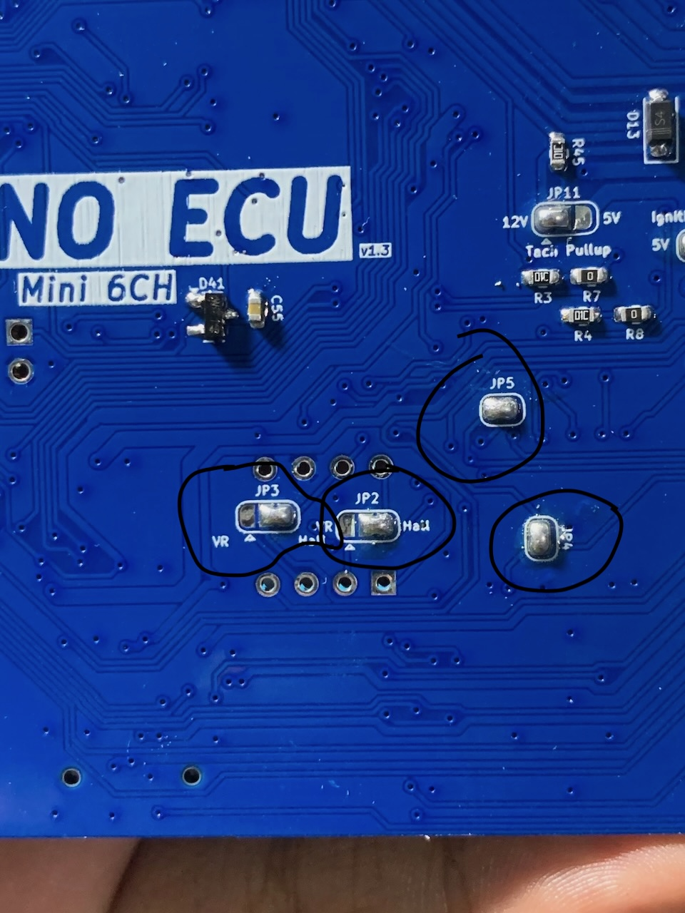

# Mazduino Mini 6CH (v1.4)

## Gambaran Umum

Mazduino Mini 6CH v1.4 adalah Engine Control Unit 6-channel terbaru dengan fitur-fitur canggih yang dirancang untuk digunakan dengan firmware rusEFI dan Speeduino. Dibangun di sekitar prosesor STM32F407VGT6 ARM 32-bit yang powerful, memberikan manajemen mesin komprehensif dengan dukungan penuh untuk teknologi terdepan seperti Variable Valve Timing (VVT), Boost Control, dan dual Electronic Throttle Body (ETB).

**Fitur Baru v1.4:**
- **VVT (Variable Valve Timing)**: Kontrol timing katup variabel untuk performa dan efisiensi optimal
- **BOOST Control**: Kontrol boost pressure terintegrasi untuk aplikasi forced induction
- **Dual ETB IC**: Dukungan dual Electronic Throttle Body dengan IC driver terintegrasi
- **Enhanced Idle Control**: Driver khusus untuk Electronic Throttle Body atau Idle Stepper Motor


## Fitur Utama
- Input trigger utama untuk sensor CKP VR, hall atau optical
- Input trigger kedua untuk sensor CMP VR, hall atau optical
- 7 input analog (0-5V) untuk MAP, TPS, IAT, CLT, O2, dan 2 cadangan yang dapat digunakan untuk sensor tekanan bahan bakar atau sensor lainnya
- Catu daya 5V untuk sensor dengan perlindungan fuse internal
- 4 input digital pullup untuk AC Switch, VSS, Clutch, Launch Control
- 8x driver low-side arus tinggi 3A untuk injektor high-impedance, idle PWM (ISC), Boost, VVT dan lainnya
- 5x driver low-side arus rendah untuk relay utama, pompa bahan bakar, kompresor AC, kipas, dan kontrol tachometer
- 6x output 12V atau 5V untuk sinyal koil pengapian
- Knock Input untuk deteksi ketukan mesin
- **VVT Control (v1.4)**: Kontrol Variable Valve Timing untuk optimasi performa
- **Boost Control (v1.4)**: Kontrol boost pressure dengan PWM presisi
- **Dual ETB Support (v1.4)**: Dukungan dual Electronic Throttle Body dengan IC driver terintegrasi
- **ETB/Stepper Compatibility (v1.4)**: Dapat menggunakan driver untuk ETB atau Idle Stepper Motor
- Dukungan untuk Modul VR Conditioner tambahan
- Prosesor 168 MHz ARM Cortex-M4
- Komunikasi data via CANbus
- Komunikasi data via USB Type-C
- Komunikasi Serial RX/TX
- Konektor otomotif 48-pin
- Kartu SD untuk data logging

## ⚙️ Konfigurasi Jumper

Mazduino Mini 6CH v1.4 dilengkapi dengan sistem jumper solder yang memungkinkan kustomisasi fungsi sesuai kebutuhan aplikasi Anda. Jumper ini memberikan fleksibilitas konfigurasi tanpa perlu mengubah firmware, memastikan kompatibilitas optimal dengan berbagai setup mesin.


### 🔌 Zona Konfigurasi Atas (Kanan)

#### JP11 - Tachometer Pullup
- **Fungsi**: Menentukan tegangan sinyal output tachometer
- **Pilihan**: 12V atau 5V
- **Aplikasi**: Sesuaikan dengan kompatibilitas dashboard kendaraan Anda

#### Ignition VDrive Jumper
- **Fungsi**: Mengatur tegangan sinyal pengapian untuk **Smart Coil Only**
- **Pilihan**: Sinyal 12V atau 5V
- **Khusus Smart Coil**: Jumper ini hanya untuk smart coil dengan driver internal
- **⚠️ PENTING**: Dump coil memerlukan IGBT eksternal 

#### Knock/PC13 Input Selection
- **Mode Knock**: Input sensor knock untuk deteksi ketukan mesin (default)
- **Mode PC13**: Akses langsung ke pin MCU untuk fungsi custom
- **Enhanced v1.4**: Sensitivitas knock detection yang ditingkatkan


### 🎛️ Zona Konfigurasi Tengah

#### JP5 & JP4 - Sensor Pullup Configuration
- **JP5**: Pullup 5V untuk sinyal CKP (Crankshaft Position)
- **JP4**: Pullup 5V untuk sinyal CMP (Camshaft Position)
- **Manfaat**: Sinyal trigger yang bersih dan stabil

#### JP3 & JP2 - Sensor Type Selection
- **JP3**: Mode sinyal CKP (VR atau Hall sensor)
- **JP2**: Mode sinyal CMP (VR atau Hall sensor)
- **Fleksibilitas**: Kompatibel dengan berbagai jenis sensor posisi



### 🌐 Zona Konfigurasi Kiri

#### JP10 - CAN Bus Controller
- **Fungsi**: Mengaktifkan IC CAN bus TJA1051T/3
- **Aplikasi**: Komunikasi data high-speed dengan perangkat lain
- **Protocol**: Mendukung standar automotive CAN 2.0

#### JP6 - ETB/Stepper Motor Mode Selection (Baru di v1.4)
- **Mode ETB**: Konfigurasi untuk Electronic Throttle Body dengan IC driver terintegrasi
- **Mode Stepper**: Konfigurasi untuk Idle Stepper Motor control
- **Fleksibilitas**: Dapat mengganti fungsi tanpa mengubah hardware
- **Default**: Mode ETB untuk aplikasi throttle control modern

#### JP7 & JP8 - Knock Sensor Filter Bypass
- **Fungsi**: Bypass filter untuk sensor knock
- **JP7**: Bypass filter knock channel 1
- **JP8**: Bypass filter knock channel 2
- **Advanced Feature**: Fine-tuning sensitivitas deteksi knock


### 💡 Tips Konfigurasi Jumper

#### ⚡ Pengaturan Optimal v1.4:
- **Smart Coils**: Gunakan VDrive 5V untuk Coil dengan sinyal 5V dan 12V untuk coil dengan sinyal 12V
- **Dump/Conventional Coils**: Memerlukan IGBT eksternal
- **VR Sensors**: Aktifkan pullup dan pilih mode VR untuk sinyal bersih
- **Hall Sensors**: Nonaktifkan pullup dan pilih mode Hall
- **ETB Mode**: Pilih mode ETB untuk aplikasi throttle elektronik modern
- **Stepper Mode**: Pilih mode stepper untuk kontrol idle konvensional

#### 🔧 Best Practices:
1. **Pre-Installation**: Konfigurasi jumper sebelum instalasi final
2. **Documentation**: Catat konfigurasi jumper untuk referensi masa depan
3. **Testing**: Verifikasi sinyal setelah perubahan konfigurasi jumper
4. **Compatibility**: Pastikan jumper sesuai dengan hardware yang digunakan
5. **ETB Testing**: Test driver ETB sebelum menghubungkan throttle body aktual
6. **VVT Calibration**: Kalibrasi sistem VVT dengan hati-hati

#### ⚠️ Perhatian Khusus:
- **Jenis Coil Kritis**: VDrive hanya untuk smart coil - dump coil butuh IGBT eksternal
- **ETB Safety**: Dual ETB memerlukan konfigurasi failsafe yang tepat
- **High Current**: Output VVT dan Boost dapat menangani arus tinggi, pastikan wiring memadai
- **Solder dengan Hati-hati**: Gunakan suhu solder yang tepat
- **Verifikasi Koneksi**: Pastikan sambungan solder yang solid
- **Konsultasi Skematik**: Rujuk diagram untuk konfigurasi lanjutan
- **Power Off**: Selalu matikan power saat mengubah jumper

## Wiring dan Instalasi

### Pin Mapping Konektor

Mazduino Mini 6CH v1.4 menggunakan konektor ECU Yamaha 48-pin dengan pin assignment yang telah ditingkatkan untuk mendukung fitur-fitur baru:


#### Layout Konektor
```
 1   2   3   4   5   6   7   8   9  10  11  12  13  14  15  16
17  18  19  20  21  22  23  24  25  26  27  28  29  30  31  32
33  34  35  36  37  38  39  40  41  42  43  44  45  46  47  48
```

#### Pin Assignment v1.4

| Pin | Fungsi | Deskripsi |
|-----|----------|-------------|
| 1 | **12V ECU** | Catu daya utama ECU |
| 2 | **IDLE1** | Output kontrol idle 1 atau ETB driver 1 |
| 3 | **IDLE2** | Output kontrol idle 2 atau ETB driver 2 |
| 4 | **VVT** | **[BARU v1.4]** Variable Valve Timing control output |
| 5 | **5V** | Output referensi 5V untuk sensor |
| 6 | **BOOST** | **[BARU v1.4]** Boost control PWM output |
| 7 | **Fuel Pump** | Kontrol relay pompa bahan bakar |
| 8 | **Knock/PC13** | Input sensor knock (default) atau akses pin MCU langsung |
| 9 | **VR1-** | Input VR conditioner 1 negatif |
| 10 | **VR2-** | Input VR conditioner 2 negatif |
| 11 | **ETB2-** | **[BARU v1.4]** Electronic Throttle Body 2 negatif |
| 12 | **ETB2+** | **[BARU v1.4]** Electronic Throttle Body 2 positif |
| 13 | **Spare Input 3** | Input analog cadangan 3 |
| 14 | **High Side** | 12V Switching / Alternator Control / VTEC Control |
| 15 | **Injector 5** | Injektor 5 atau output arus tinggi cadangan (boost/vvt/control pwm) |
| 16 | **Injector 6** | Injektor 6 atau output arus tinggi cadangan (boost/vvt/control pwm) |
| 17 | **Main Relay** | Kontrol relay utama (low current low side) |
| 18 | **Spare Analog 1/PPS1** | Input analog cadangan 1 atau Pedal Position Sensor 1 |
| 19 | **VSS** | Sensor kecepatan kendaraan (Vehicle Speed Sensor) |
| 20 | **AC-IN** | Input switch AC |
| 21 | **AC Relay** | Kontrol relay kompresor AC |
| 22 | **GND** | Ground ECU |
| 23 | **Fan** | Kontrol relay kipas |
| 24 | **Ignition 6** | Channel pengapian 6 |
| 25 | **Ignition 5** | Channel pengapian 5 |
| 26 | **Ignition 1** | Channel pengapian 1 |
| 27 | **Ignition 2** | Channel pengapian 2 |
| 28 | **Ignition 3** | Channel pengapian 3 |
| 29 | **Ignition 4** | Channel pengapian 4 |
| 30 | **TPS** | Sensor posisi throttle (TPS1) |
| 31 | **MAP** | Sensor tekanan absolut manifold |
| 32 | **Injector 4** | Channel injektor 4 |
| 33 | **ETB-** | Electronic Throttle Body 1 negatif |
| 34 | **ETB+** | Electronic Throttle Body 1 positif |
| 35 | **Spare Analog 2/PPS2** | Input analog cadangan 2 atau Pedal Position Sensor 2 |
| 36 | **Clutch** | Input posisi kopling |
| 37 | **GND Sensor** | Ground sensor |
| 38 | **GND Sensor** | Ground sensor |
| 39 | **RPM/Tacho** | Output tachometer |
| 40 | **Launch Control** | Input launch control |
| 41 | **VR1+** | Sensor VR 1 positif |
| 42 | **VR2+** | Sensor VR 2 positif |
| 43 | **O2/TPS2** | Sensor oksigen (1-5V dari kontroler wideband) atau TPS2 untuk ETB |
| 44 | **IAT** | Sensor suhu udara masuk |
| 45 | **CLT** | Sensor suhu coolant |
| 46 | **Injector 2** | Channel injektor 2 |
| 47 | **Injector 1** | Channel injektor 1 |
| 48 | **Injector 3** | Channel injektor 3 |

### Pin Mapping MCU v1.4

Untuk pengguna lanjutan dan pengembangan firmware, berikut adalah pin assignment STM32F407VGT6 untuk v1.4:

| Function | MCU Pin | Keterangan |
|----------|---------|------------|
| Ignition Output 1 | PE15 | Channel pengapian 1 |
| Ignition Output 2 | PE14 | Channel pengapian 2 |
| Ignition Output 3 | PD13 | Channel pengapian 3 |
| Ignition Output 4 | PE5 | Channel pengapian 4 |
| Ignition Output 5 | PE2 | Channel pengapian 5 |
| Ignition Output 6 | PE3 | Channel pengapian 6 |
| Injection Output 1 | PD8 | Channel injektor 1 |
| Injection Output 2 | PB15 | Channel injektor 2 |
| Injection Output 3 | PB14 | Channel injektor 3 |
| Injection Output 4 | PB13 | Channel injektor 4 |
| Injection Output 5 | PD9 | Channel injektor 5 |
| Injection Output 6 | PE8 | Channel injektor 6 |
| MAP Sensor | PA0 | Input sensor MAP |
| TPS | PA3 | Input sensor TPS1 |
| IAT Sensor | PA5 | Input sensor suhu udara |
| CLT Sensor | PA4 | Input sensor suhu coolant |
| O2 Sensor | PA1 | Input sensor oksigen |
| Battery/Voltage Ref | PA2 | Referensi tegangan baterai |
| Analog Spare Input 1 | PB0 | Input analog cadangan 1 |
| Analog Spare Input 2 | PB1 | Input analog cadangan 2 |
| AC Input | PB5 | Input switch AC |
| Launch Control Input | PE13 | Input launch control |
| Clutch Input | PE12 | Input sensor kopling |
| VSS | PD7 | Input sensor kecepatan |
| CKP | PD3 | Input sensor posisi crankshaft |
| CMP | PD4 | Input sensor posisi camshaft |
| Tacho | PC9 | Output tachometer |
| Fuelpump Relay | PC8 | Kontrol relay pompa bahan bakar |
| FAN Relay | PA15 | Kontrol relay kipas |
| AC Compressor Relay | PC7 | Kontrol relay kompresor AC |
| Main Relay | PC5 | Kontrol relay utama |
| Idle 1 | PD10 | Output idle control 1 |
| Idle 2 | PE9 | Output idle control 2 |
| High Side | PD15 | Output 12V switching |
| **ETB-DIR** | **PB8** | **[v1.4]** ETB direction control |
| **ETB-DIS** | **PB9** | **[v1.4]** ETB disable control |
| **ETB-PWM** | **PA8** | **[v1.4]** ETB PWM control |
| **ETB2-DIR** | **PD12** | **[BARU v1.4]** ETB2 direction control |
| **ETB2-DIS** | **PD11** | **[BARU v1.4]** ETB2 disable control |
| **ETB2-PWM** | **PD14** | **[BARU v1.4]** ETB2 PWM control |
| **VVT** | **PB6** | **[BARU v1.4]** Variable valve timing |
| **BOOST** | **PB4** | **[BARU v1.4]** Boost control PWM |
| Knock1 | PA3 | Input sensor knock 1 |
| TXD1 | PA9 | UART1 transmit |
| RXD1 | PA10 | UART1 receive |
| TXD3 | PB10 | UART3 transmit |
| RXD3 | PB11 | UART3 receive |
| TXCAN | PD1 | CAN transmit |
| RXCAN | PD0 | CAN receive |
| SD CS | PD2 | SD card chip select |
| SPI3 CLK | PC10 | SPI3 clock |
| SPI3 MISO | PC11 | SPI3 master in |
| SPI3 MOSI | PC12 | SPI3 master out |

### Fitur Khusus v1.4

#### Variable Valve Timing (VVT) - Baru di v1.4
- **Pin 4 (VVT)**: Output kontrol VVT dengan PWM presisi
- **MCU Pin**: PB6 untuk kontrol timing katup variabel
- **Aplikasi**: 
  - Optimasi torsi dan power di berbagai RPM
  - Pengurangan emisi dan konsumsi bahan bakar
  - Kontrol overlap katup untuk performa maksimal
- **Konfigurasi**: PWM duty cycle untuk kontrol posisi aktuator VVT

#### Boost Control System - Baru di v1.4
- **Pin 6 (BOOST)**: Output kontrol boost pressure
- **MCU Pin**: PB4 untuk kontrol wastegate atau blow-off valve
- **Aplikasi**:
  - Kontrol boost pressure pada aplikasi turbocharger
  - Managemen overboost protection
  - Electronic boost controller dengan feedback MAP sensor
- **Konfigurasi**: PWM control untuk wastegate actuator

#### Dual Electronic Throttle Body (ETB) - Baru di v1.4
- **ETB1**: Pin 33/34 (ETB-/ETB+) dengan kontrol PB8, PB9, PA8
- **ETB2**: Pin 11/12 (ETB2-/ETB2+) dengan kontrol PD12, PD11, PD14 **[BARU]**
- **Dual TPS Support**: TPS1 (pin 30) dan TPS2 (pin 43)
- **Dual PPS Support**: PPS1 (pin 18) dan PPS2 (pin 35)
- **IC Driver Terintegrasi**: Driver H-bridge dengan proteksi overcurrent
- **Aplikasi**:
  - Sistem throttle redundant untuk aplikasi kritis
  - Dual throttle untuk mesin V-configuration
  - Primary dan secondary throttle control

#### Enhanced Idle Control - v1.4
- **Dual Mode Operation**: ETB atau Stepper Motor control
- **ETB Mode**: Menggunakan driver ETB untuk throttle control presisi
- **Stepper Mode**: Kontrol tradisional dengan stepper motor driver
- **Pin Assignment**: 
  - IDLE1 (pin 2): PD10 untuk kontrol idle 1
  - IDLE2 (pin 3): PE9 untuk kontrol idle 2
- **Fleksibilitas**: Dapat dikonfigurasi via jumper JP6

#### High Current Low Side Outputs - Enhanced v1.4
- **Injector 5 & 6**: Dapat digunakan untuk:
  - VVT control (high current)
  - Boost control (high current)
  - Additional PWM control output
  - Water injection control
  - Methanol injection control
- **Current Rating**: 3A continuous per channel

### Panduan Instalasi v1.4

#### 1. Persiapan Sistem
- **Power Supply**: Pastikan sistem kelistrikan 12V stabil
- **Grounding**: Gunakan multiple ground points untuk noise reduction
- **Cooling**: Pasang ECU dengan ventilasi memadai

#### 2. Instalasi Dasar
1. **Mounting**: Pasang ECU di lokasi yang aman dari panas dan getaran
2. **Power Connection**: 
   - Pin 1: 12V switched power
   - Pin 22: Main ground
   - Pin 37, 38: Sensor ground
3. **Engine Position Sensors**:
   - CKP sensor ke pin 41/42 atau pin 9/10 (VR)
   - CMP sensor sesuai konfigurasi jumper

#### 3. Instalasi Fitur Baru v1.4

##### VVT Installation
1. **Wiring VVT Actuator**:
   - Hubungkan VVT solenoid ke pin 4 (VVT)
   - Ground VVT actuator ke chassis
   - Pastikan wiring tahan panas engine bay
2. **VVT Position Sensor**:
   - Gunakan input analog cadangan untuk feedback posisi
   - Kalibrasi range sensor dalam TunerStudio

##### Boost Control Installation
1. **Boost Actuator Wiring**:
   - Hubungkan wastegate actuator ke pin 6 (BOOST)
   - Pastikan actuator compatible dengan PWM control
2. **Boost Pressure Sensor**:
   - Gunakan MAP sensor atau sensor boost terpisah
   - Konfigurasi boost target dan limit dalam firmware

##### Dual ETB Installation
1. **ETB1 (Primary)**:
   - ETB motor ke pin 33/34 (ETB-/ETB+)
   - TPS1 ke pin 30
   - TPS2 ke pin 43 untuk redundancy
2. **ETB2 (Secondary)** - **[BARU v1.4]**:
   - ETB motor ke pin 11/12 (ETB2-/ETB2+)
   - Gunakan input analog tambahan untuk TPS feedback
3. **Pedal Position**:
   - PPS1 ke pin 18
   - PPS2 ke pin 35 untuk redundancy
4. **Safety Configuration**:
   - Konfigurasi failsafe values
   - Set limp-home mode parameters
   - Test emergency shutdown

#### 4. Konfigurasi Lanjutan

##### Idle Control Setup (v1.4)
- **Mode ETB**: Konfigurasi jumper JP6 untuk mode ETB
- **Mode Stepper**: Konfigurasi jumper JP6 untuk mode stepper
- **Pin Assignment**:
  - IDLE1 (pin 2) untuk primary idle control
  - IDLE2 (pin 3) untuk secondary atau backup

##### High Current Outputs (Injector 5&6)
- **VVT Control**: Gunakan injector 5/6 untuk VVT tambahan
- **Boost Control**: Alternative boost control output
- **Water/Meth Injection**: Kontrol sistem injeksi tambahan

### Catatan Instalasi v1.4

#### ⚠️ Safety Considerations
1. **ETB Safety**: Dual ETB memerlukan sistem failsafe yang robust
2. **VVT Timing**: Incorrect VVT timing dapat merusak engine
3. **Boost Limits**: Set boost limits untuk melindungi engine
4. **High Current**: Pastikan wiring memadai untuk output arus tinggi

#### 🔧 Best Practices
1. **Testing**: Test setiap sistem secara terpisah sebelum integrasi
2. **Documentation**: Catat semua konfigurasi untuk troubleshooting
3. **Backup**: Simpan konfigurasi TunerStudio sebagai backup
4. **Monitoring**: Monitor semua parameter selama initial tuning
5. **Professional Tuning**: Konsultasi dengan tuner berpengalaman untuk setup kompleks

#### 📊 Performance Optimization
- **VVT Mapping**: Map VVT timing untuk berbagai kondisi RPM/load
- **Boost Control**: Tune boost control untuk response optimal
- **ETB Response**: Kalibrasi ETB response untuk drivability terbaik
- **Integration**: Optimasi interaksi antara VVT, boost, dan ETB

## Dukungan dan Sumber Daya

### Dokumentasi v1.4
- **Enhanced Manual**: Dokumentasi lengkap dengan fitur-fitur baru v1.4
- **VVT Tuning Guide**: Panduan tuning Variable Valve Timing
- **Boost Control Setup**: Tutorial setup sistem boost control
- **Dual ETB Configuration**: Panduan konfigurasi dual throttle body
- **Wiring Diagrams**: Diagram wiring dengan fitur-fitur baru v1.4

### File Firmware & Konfigurasi
- **[Halaman Download](downloads.md)** - Dapatkan firmware rusEFI terbaru dan file konfigurasi TunerStudio
- **rusEFI v1.4 Support**: Firmware dengan dukungan penuh fitur v1.4
- **TunerStudio Templates**: Template konfigurasi siap pakai
- **Pin Mapping Files**: File konfigurasi pin mapping untuk v1.4
- **Example Configurations**:
  - VVT setup examples
  - Boost control configurations
  - Dual ETB setups

### Community Support
- **Forum Mazduino**: Diskusi teknis dan troubleshooting
- **rusEFI Community**: Dukungan firmware dan tuning
- **Facebook Groups**: Komunitas pengguna Indonesia
- **YouTube Channel**: Tutorial video dan case studies

## Kompatibilitas dan Upgrade

### Upgrade dari v1.3 ke v1.4
- **Hardware**: Tidak kompatibel langsung - perlu penggantian ECU
- **Wiring**: Beberapa pin assignment berubah, perlu rewiring
- **Firmware**: Menggunakan firmware rusEFI khusus v1.4
- **Configuration**: Template TunerStudio baru untuk fitur v1.4

### Firmware Support
- **rusEFI**: Dukungan penuh dengan konfigurasi khusus v1.4
- **Speeduino**: Dalam development untuk dukungan fitur v1.4
- **Custom Firmware**: Dokumentasi pin mapping tersedia untuk development

### Accessories Compatibility
- **VR Conditioner Module**: Compatible dengan modul existing
- **CAN Bus Devices**: Compatible dengan standar automotive CAN
- **SD Card**: Mendukung kartu SD hingga 32GB untuk data logging
- **USB Type-C**: Komunikasi high-speed untuk tuning dan diagnostics

## Spesifikasi Teknis v1.4

### Hardware Specifications
- **MCU**: STM32F407VGT6 ARM Cortex-M4 @ 168MHz
- **Flash Memory**: 1MB untuk firmware dan konfigurasi
- **RAM**: 192KB untuk operasi real-time
- **ADC**: 12-bit resolution, 1µs sampling time
- **PWM Resolution**: 16-bit untuk kontrol presisi
- **Operating Temperature**: -40°C to +85°C
- **Input Voltage**: 9V - 16V (12V nominal)
- **Current Consumption**: <200mA @ 12V
- **Dimensions**: Compatible dengan mounting bracket existing

### Performance Specifications
- **Maximum RPM**: 20,000 RPM (configurable)
- **Injection Timing Resolution**: 0.1ms
- **Ignition Timing Resolution**: 0.1° crank angle
- **VVT Response Time**: <100ms typical
- **ETB Response Time**: <50ms typical
- **Boost Control Response**: <200ms typical
- **Data Logging Rate**: Up to 100Hz per channel

### Output Specifications
- **High Current Outputs**: 8x @ 3A continuous (injectors, VVT, boost)
- **Low Current Outputs**: 5x @ 500mA (relays, tacho)
- **Ignition Outputs**: 6x @ 12V/5V selectable
- **ETB Outputs**: 2x H-bridge @ 10A peak
- **VVT Output**: PWM @ 1kHz, 3A continuous
- **Boost Output**: PWM @ 100Hz, 3A continuous

### Input Specifications
- **Analog Inputs**: 7x 0-5V, 12-bit resolution
- **Digital Inputs**: 4x with internal pullup
- **VR Inputs**: 2x with conditioning circuit
- **Knock Inputs**: 1x with integrated amplifier and filter
- **CAN Bus**: ISO 11898 compliant
- **Serial**: 2x UART (USB + dedicated)

## Catatan Penting v1.4

### Persyaratan Sistem Pengapian
- **Smart Coils**: Koneksi langsung didukung dengan voltage selection
- **Dump Coils**: IGBT eksternal diperlukan untuk operasi yang tepat
- **Coil Selection**: Critical untuk system reliability dan performance

### Variable Valve Timing (VVT)
- **Engine Compatibility**: Pastikan engine mendukung VVT mechanism
- **Actuator Selection**: Gunakan VVT actuator yang sesuai dengan engine
- **Timing Safety**: Incorrect VVT timing dapat menyebabkan valve interference
- **Oil Pressure**: VVT memerlukan oil pressure minimal untuk operasi

### Boost Control System
- **Turbo/Supercharger**: Compatible dengan berbagai jenis forced induction
- **Wastegate Type**: Mendukung pneumatic dan electronic wastegate
- **Safety Limits**: Set overboost protection untuk keamanan engine
- **Response Tuning**: Tune PID parameters untuk response optimal

### Dual ETB System
- **Failsafe Critical**: Dual ETB harus memiliki sistem failsafe yang robust
- **TPS Redundancy**: Dual TPS untuk safety dan accuracy
- **PPS Redundancy**: Dual PPS untuk pedal input validation
- **Emergency Mode**: Konfigurasi limp-home mode untuk kondisi emergency

### Sistem Terintegrasi
- **VVT + Boost**: Koordinasi antara VVT dan boost untuk performance optimal
- **ETB + VVT**: Integrasi throttle control dan valve timing
- **All Systems**: Tuning holistik untuk performa dan efisiensi maksimal

### Professional Installation Recommended
Mengingat kompleksitas fitur-fitur baru v1.4, sangat disarankan untuk menggunakan jasa installer dan tuner yang berpengalaman dengan sistem:
- Variable Valve Timing
- Electronic Boost Control
- Dual Electronic Throttle Body
- Advanced engine management systems

Dokumentasi ini memberikan overview komprehensif, namun implementasi yang optimal memerlukan pemahaman mendalam tentang engine management dan tuning experience.