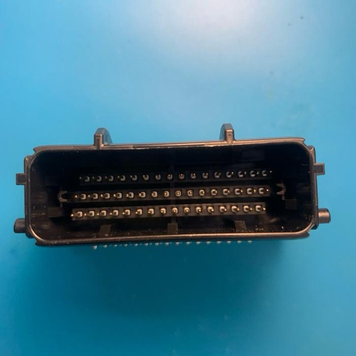

# Mazduino Mini 6CH

## Overview

The Mazduino Mini 6CH is a compact 6-channel engine control unit designed for use with rusEFI and Speeduino firmware. Built around the powerful STM32F407VGT6 ARM 32-bit processor, it provides comprehensive engine management in a compact form factor suitable for 6-cylinder engines or 4-cylinder engines with additional high-current outputs.


## Key Features
- Primary trigger input for CKP VR, hall or optical sensor
- Secondary trigger input for CMP VR, hall or optical sensor
- 7 analog inputs (0-5V) for MAP, TPS, IAT, CLT, O2, and 2 spare that can be used for fuel pressure or other sensors
- 5V power supply for sensors with internal fuse protection
- 4 digital pullup inputs for AC Switch, VSS, Clutch, Launch Control
- 8x high current low-side drivers 3A for high-impedance injectors, idle PWM (ISC), Boost, VVT and others
- 5x low current low-side drivers for main relay, fuel pump, AC compressor, fan, and tachometer control
- 6x 12V or 5V outputs for ignition coil signals
- Support for additional VR Conditioner Module
- Support for additional Stepper Idle Module
- 168 MHz ARM Cortex-M4 processor
- Data communication via CANbus
- Data communication via USB Type-C
- Serial RX/TX communication
- 48-pin automotive connector
- SD card for data logging

## Wiring and Installation

### Connector Pin Mapping

The Mazduino Mini 6CH uses a 48-pin Yamaha ECU connector with the following pin assignments:



#### Connector Layout
```
 1   2   3   4   5   6   7   8   9  10  11  12  13  14  15  16
17  18  19  20  21  22  23  24  25  26  27  28  29  30  31  32
33  34  35  36  37  38  39  40  41  42  43  44  45  46  47  48
```

#### Pin Assignments

| Pin | Function | Description |
|-----|----------|-------------|
| 1 | 12V ECU | Main ECU power supply |
| 2 | IDLE1 | Idle control output 1 |
| 3 | IDLE2 | Idle control output 2 |
| 4 | CANH | CAN bus high |
| 5 | 5V | 5V reference output |
| 6 | AC Compressor | AC compressor control |
| 7 | Fuel Pump | Fuel pump relay control |
| 8 | PC13 | Direct MCU pin access |
| 9 | VR-1 | VR conditioner input 1 |
| 10 | VR-2 | VR conditioner input 2 |
| 11 | Stepper B2 | Stepper motor phase B2 |
| 12 | Stepper B1 | Stepper motor phase B1 |
| 13 | Stepper A1 | Stepper motor phase A1 |
| 14 | Stepper A2 | Stepper motor phase A2 |
| 15 | Injector 5 | Injector 5 or spare high-current output |
| 16 | Injector 6 | Injector 6 or spare high-current output |
| 17 | GND ECU | ECU ground |
| 18 | Spare Analog 1 | Spare analog input 1 |
| 19 | VSS | Vehicle speed sensor |
| 20 | AC Switch | AC switch input |
| 21 | CANL | CAN bus low |
| 22 | GND Sensor | Sensor ground |
| 23 | Fan | Fan relay control |
| 24 | Ignition 6 | Ignition channel 6 |
| 25 | Ignition 5 | Ignition channel 5 |
| 26 | Ignition 1 | Ignition channel 1 |
| 27 | Ignition 2 | Ignition channel 2 |
| 28 | Ignition 3 | Ignition channel 3 |
| 29 | Ignition 4 | Ignition channel 4 |
| 30 | TPS | Throttle position sensor |
| 31 | MAP | Manifold absolute pressure |
| 32 | Injector 4 | Injector channel 4 |
| 33 | Main Relay | Main relay control |
| 34 | GND Sensor | Sensor ground |
| 35 | Spare Analog 2 | Spare analog input 2 |
| 36 | Clutch | Clutch position input |
| 37 | GND Sensor | Sensor ground |
| 38 | GND Sensor | Sensor ground |
| 39 | Tacho | Tachometer output |
| 40 | Launch Control | Launch control input |
| 41 | VR1+ | VR sensor 1 positive |
| 42 | VR2+ | VR sensor 2 positive |
| 43 | O2 | Oxygen sensor (1-5V from wideband controller) |
| 44 | IAT | Intake air temperature |
| 45 | CLT | Coolant temperature |
| 46 | Injector 2 | Injector channel 2 |
| 47 | Injector 1 | Injector channel 1 |
| 48 | Injector 3 | Injector channel 3 |

### MCU Pin Mapping

For advanced users and firmware development, here are the STM32F407VGT6 pin assignments:

| Function | MCU Pin |
|----------|---------|
| Ignition Output 1 | PE15 |
| Ignition Output 2 | PE14 |
| Ignition Output 3 | PD13 |
| Ignition Output 4 | PE5 |
| Ignition Output 5 | PE2 |
| Ignition Output 6 | PE3 |
| Injection Output 1 | PD8 |
| Injection Output 2 | PB15 |
| Injection Output 3 | PB14 |
| Injection Output 4 | PB13 |
| Injection Output 5 | PD9 |
| Injection Output 6 | PE8 |
| MAP Sensor | PA0 |
| TPS | PA3 |
| IAT Sensor | PA5 |
| CLT Sensor | PA4 |
| O2 Sensor | PA1 |
| Battery/Voltage Ref | PA2 |
| Analog Spare Input 1 | PB0 |
| Analog Spare Input 2 | PB1 |
| AC Input | PB5 |
| Launch Control Input | PE13 |
| Clutch Input | PB10 |
| VSS | PD7 |
| CKP | PD3 |
| CMP | PD4 |
| Tacho | PC9 |
| Fuel Pump Relay | PC8 |
| FAN Relay | PA15 |
| AC Compressor Relay | PC7 |
| Main Relay | PC6 |
| Idle 1 | PD10 |
| Idle 2 | PE9 |
| Stepper DIR | PD12 |
| Stepper ENBL | PD14 |
| Stepper STEP | PD15 |
| TXD1 | PA9 |
| RXD1 | PA10 |
| TXD3 | PB10 |
| RXD3 | PB11 |
| TXCAN | PD1 |
| RXCAN | PD0 |
| SD CS | PD2 |
| SPI3 CLK | PC10 |
| SPI3 MISO | PC11 |
| SPI3 MOSI | PC12 |

### Special Features

#### VR Conditioner Support
- **VR-1 & VR-2**: Input pins for VR conditioner module (DIP 8)
- **VR1+ & VR2+**: Positive VR sensor inputs

#### Stepper Motor Control
- **Stepper A1/A2**: Phase A outputs for stepper motor (DRV8825)
- **Stepper B1/B2**: Phase B outputs for stepper motor
- **Direction/Enable/Step**: Control signals for stepper driver

#### Flexible Injector Configuration
For 4-cylinder engines:
- **Injectors 5 & 6**: Can be used as spare high-current outputs
- **Applications**: Boost control, VVT control, water injection, etc.

### Installation Guidelines
1. **Mounting**: Secure ECU in appropriate location with proper cooling
2. **Power Connection**: Connect 12V power (pin 1) and ground (pin 17)
3. **Sensor Grounds**: Use multiple sensor ground pins (22, 34, 37, 38) for clean signals
4. **Engine Position Sensors**: Connect CKP/CMP sensors or use VR inputs as needed
5. **Module Installation**: Install VR-Conditioner and/or Stepper modules if required
6. **Verification**: Test all connections before initial startup

### Wiring Notes
- **Multiple Grounds**: Use all available ground pins for optimal signal integrity
- **5V Reference**: Pin 5 provides 5V reference for sensors requiring it
- **O2 Sensor**: Pin 43 accepts 1-5V signal from wideband controller analog output
- **VR Sensors**: Can use either digital inputs or VR conditioner module inputs
- **Yamaha Connector**: Professional automotive-grade 48-pin connector
- **Wiring Compatibility**: Compatible with Speeduino wiring standards
- **Reference**: Additional sensor wiring information at [Speeduino Wiki](https://wiki.speeduino.com/en/wiring/system)

## Module Support

### VR-Conditioner Module
- **DIP 8 Package**: Easy installation and replacement
- **VR Sensor Support**: Convert VR signals to digital (pins 9, 10)
- **Signal Conditioning**: Clean, reliable trigger signals
- **Compatibility**: Works with various VR sensor types

### Stepper Motor Module
- **DRV8825 Driver**: High-performance stepper control
- **Idle Air Control**: Precise idle speed management (pins 11-14)
- **Easy Integration**: Plug-and-play module design
- **Reliable Operation**: Automotive-grade components

## Important Notes

### Ignition System Requirements
- **Smart Coils**: Direct connection supported
- **Dump Coils**: External IGBT required for proper operation
- **Coil Selection**: Choose appropriate coil type for your application
- **Safety**: Proper external drivers essential for dump coil systems

### Firmware & Configuration Files
- **[Download Page](downloads.md)** - Get the latest rusEFI firmware and TunerStudio configuration files
- Full 6-channel support with advanced features
- Custom pin mapping configuration included
- Compatible with both rusEFI firmware

