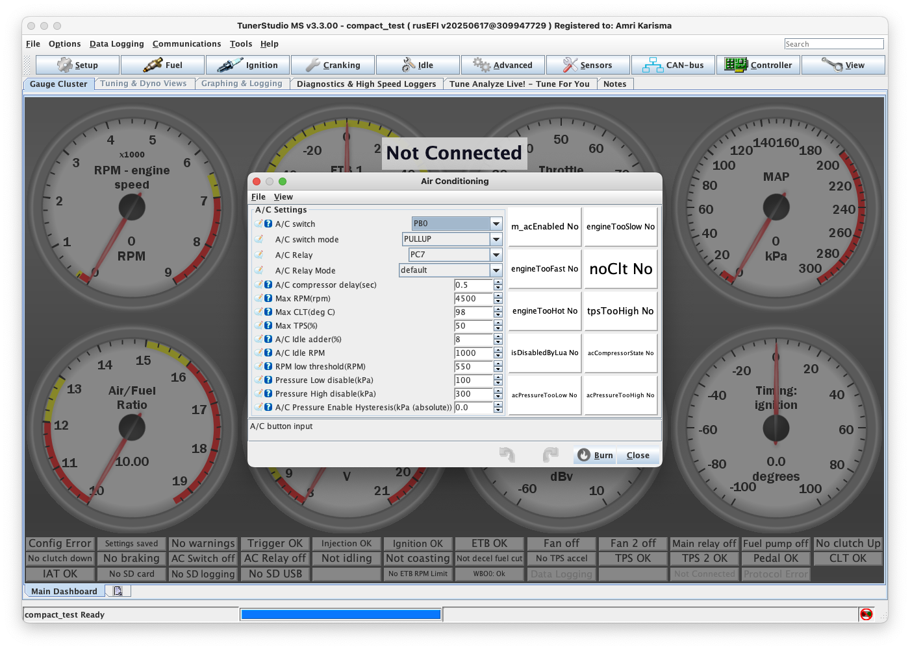

# Pengaturan Air Conditioning (A/C) - TunerStudio

## Pengantar

Bagian A/C Settings memungkinkan konfigurasi kontrol air conditioning dalam ECU, mencakup fitur seperti compressor delay, kompensasi idle, dan kontrol berbasis tekanan untuk mengoptimalkan performa dan mengelola beban mesin. Untuk unit Plug and Play, pengaturan A/C mungkin sudah dikonfigurasi dalam basemap, meskipun penyesuaian masih dapat dilakukan untuk memenuhi kebutuhan spesifik. Unit Kit/DIY mungkin memerlukan konfigurasi lengkap pengaturan ini berdasarkan setup kendaraan.

## Pengaturan Utama A/C

### Input Controls

**A/C Switch**: Memilih sumber input untuk mengaktifkan sistem A/C. Mengatur ini ke NONE akan menonaktifkan kontrol ECU atas switch A/C, selama tidak dikontrol oleh metode lain, seperti Lua.

**A/C Switch Mode**: Menentukan mode input switch A/C, tergantung pada instalasi dan fungsionalitas yang diinginkan.

### Output Controls

**A/C Relay**: Mengkonfigurasi pin output yang ditugaskan untuk mengontrol relay A/C. Misalnya, memilih PC7 memungkinkan kontrol A/C melalui pin spesifik tersebut.

**A/C Relay Mode**: Mendefinisikan mode output relay A/C. Ini dapat dibiarkan sebagai default untuk sebagian besar aplikasi atau disesuaikan jika diperlukan.

## Pengaturan Timing dan Proteksi

### Compressor Delay
**A/C Compressor Delay (sec)**: Mengatur penundaan sebelum kompresor A/C aktif, mencegah peningkatan beban mendadak pada mesin ketika A/C dinyalakan.
- **Rekomendasi**: 1-3 detik untuk startup yang smooth
- **Aplikasi**: Mengurangi shock load pada mesin

### Batas Operasi Maximum

**Max RPM (RPM)**: Mengatur RPM mesin maksimum yang diizinkan untuk operasi A/C. Jika RPM melebihi batas ini, A/C akan dinonaktifkan untuk melindungi mesin.
- **Rekomendasi**: 6000-6500 RPM untuk mesin standar
- **Tujuan**: Melindungi mesin pada RPM tinggi

**Max CLT (deg C)**: Mengkonfigurasi suhu coolant maksimum untuk operasi A/C. Jika terlampaui, A/C akan otomatis mati untuk mencegah overheating.
- **Rekomendasi**: 100-105°C untuk mesin standar
- **Tujuan**: Mencegah overheating mesin

**Max TPS (%)**: Mendefinisikan posisi throttle maksimum untuk operasi A/C. Jika throttle melebihi persentase ini, A/C akan mati untuk memprioritaskan performa mesin.
- **Rekomendasi**: 80-90% untuk performa optimal
- **Aplikasi**: Full throttle performance priority

## Kompensasi Idle

### Idle Speed Compensation
**A/C Idle Adder (%)**: Mengatur persentase peningkatan kecepatan idle untuk mengkompensasi beban yang disebabkan oleh kompresor A/C.
- **Rekomendasi**: 10-15% untuk sebagian besar mesin
- **Penyesuaian**: Sesuaikan berdasarkan beban kompresor

**A/C Idle RPM**: Menentukan target idle RPM ketika A/C aktif, menyesuaikan kecepatan idle mesin untuk memperhitungkan beban kompresor.
- **Rekomendasi**: +100-200 RPM dari idle normal
- **Aplikasi**: Mencegah engine stalling saat A/C aktif

### RPM Protection
**RPM Low Threshold (RPM)**: Ambang batas RPM minimum di bawah mana A/C secara otomatis dinonaktifkan untuk mencegah mesin mati.
- **Rekomendasi**: 400-500 RPM di bawah idle normal
- **Safety**: Mencegah engine stalling

## Kontrol Tekanan Sistem

### Pressure Limits
**Pressure Low Disable (kPa)**: Mengatur batas tekanan rendah; jika tekanan turun di bawah level ini, A/C akan dinonaktifkan untuk melindungi kompresor.
- **Rekomendasi**: Sesuai dengan spesifikasi sistem A/C kendaraan
- **Tujuan**: Perlindungan kompresor dari kerusakan

**Pressure High Disable (kPa)**: Mengkonfigurasi batas tekanan tinggi; jika tekanan melebihi level ini, A/C akan dinonaktifkan untuk perlindungan sistem.
- **Rekomendasi**: Sesuai dengan spesifikasi sistem A/C kendaraan  
- **Tujuan**: Perlindungan sistem dari tekanan berlebih

### Hysteresis Control
**A/C Pressure Enable Hysteresis (kPa)**: Menyediakan rentang buffer di sekitar batas tekanan untuk mencegah cycling cepat sistem A/C.
- **Rekomendasi**: 50-100 kPa untuk operasi yang stabil
- **Fungsi**: Mencegah on/off yang terlalu sering

## Indikator Status A/C

Kotak putih di sisi kanan jendela mewakili berbagai pemeriksaan dan status yang terkait dengan sistem A/C. Indikator ini berubah merah untuk menunjukkan kondisi aktif, seperti:

- **A/C Button**: Tombol A/C ditekan/aktif
- **Pressure OK**: Tekanan dalam batas yang dapat diterima
- **RPM OK**: RPM dalam rentang operasi A/C
- **CLT OK**: Suhu coolant dalam batas normal
- **TPS OK**: Throttle position dalam batas A/C
- **System Ready**: Semua kondisi terpenuhi untuk operasi A/C

Umpan balik visual ini membantu pengguna dengan cepat menilai apakah semua kondisi terpenuhi untuk operasi A/C.

## Rekomendasi Konfigurasi

### Untuk Unit Plug and Play
- Pengaturan biasanya sudah dioptimalkan dalam basemap
- Fokus pada penyesuaian suhu dan tekanan sesuai sistem kendaraan
- Verifikasi idle compensation sesuai dengan karakteristik mesin

### Untuk Unit Kit/DIY
- Konfigurasi lengkap diperlukan sesuai spesifikasi kendaraan
- Konsultasi manual kendaraan untuk nilai tekanan yang tepat
- Test semua fungsi proteksi sebelum penggunaan normal

### Best Practices
1. **Start Conservative**: Mulai dengan nilai yang aman dan sesuaikan bertahap
2. **Monitor Temperature**: Selalu monitor suhu coolant saat A/C beroperasi
3. **Test All Limits**: Verifikasi semua batas proteksi berfungsi dengan baik
4. **Document Changes**: Catat semua perubahan untuk referensi masa depan

---

**[← Kembali ke Manual TunerStudio](tunerstudio-manual.md)**