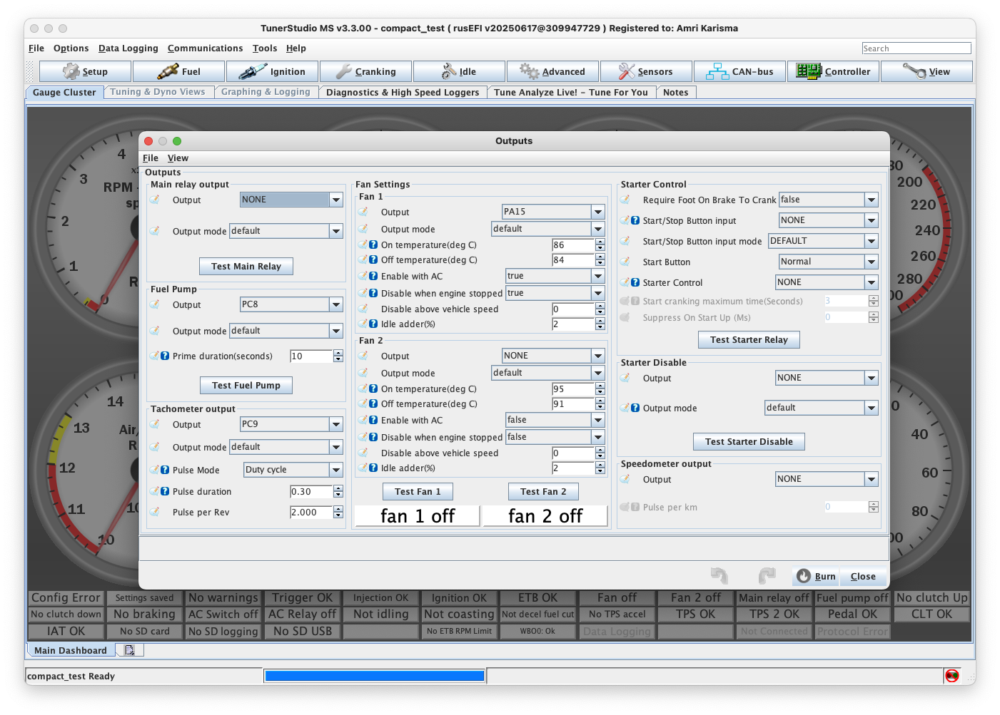

# Pengaturan Output Controls - TunerStudio

## Pengantar

Di jendela pengaturan Outputs, Anda akan menemukan opsi untuk mengkonfigurasi berbagai kontrol output untuk ECU. Untuk unit Plug and Play, sebagian besar pengaturan ini ditangani oleh basemap yang disertakan, sehingga hanya penyesuaian spesifik (seperti suhu, timing, dan adder) yang biasanya perlu dimodifikasi. Untuk unit Kit/DIY, yang tidak dilengkapi dengan basemap yang sudah dikonfigurasi, setiap pengaturan harus ditinjau dengan hati-hati dan dikonfigurasi untuk memastikan kompatibilitas dengan kendaraan.

## Ringkasan Kontrol Output

**Main Relay Output**: Menentukan kontrol relay utama, termasuk channel output dan mode. Relay ini umumnya digunakan untuk memberikan daya pada komponen kunci seperti sistem bahan bakar dan pengapian.

**Fuel Pump**: Mengkonfigurasi kontrol pompa bahan bakar, dengan opsi untuk channel output, mode, dan durasi priming (dalam detik). Ini mengontrol berapa lama pompa bahan bakar melakukan priming selama startup.

**Tachometer Output**: Mengelola sinyal tachometer dengan opsi untuk mode pulsa dan durasi. Pengaturan ini biasanya disesuaikan pada basemap Plug and Play untuk kompatibilitas dengan dashboard mobil, tetapi harus dikonfigurasi untuk unit Kit/DIY.

## Main Relay Output
- **Fungsi**: Mengontrol relay utama untuk sistem bahan bakar dan pengapian
- **Channel**: Pilih output channel yang sesuai untuk relay utama
- **Mode**: Konfigurasi mode operasi relay
- **Aplikasi**: Umumnya digunakan untuk mengaktifkan sistem utama ECU

## Fuel Pump (Pompa Bahan Bakar)
- **Output Channel**: Tentukan channel output untuk kontrol pompa bahan bakar
- **Mode**: Pilih mode operasi (Normal/Inverted)
- **Priming Duration**: Durasi priming dalam detik saat startup
  - **Rekomendasi**: 2-5 detik untuk mesin standar
  - **Penyesuaian**: Sesuaikan berdasarkan volume sistem bahan bakar

## Tachometer Output
- **Pulse Mode**: Konfigurasi mode sinyal untuk dashboard
- **Duration**: Durasi pulsa tachometer
- **Compatibility**: Biasanya sudah dikonfigurasi pada basemap Plug and Play
- **Custom Setup**: Perlu konfigurasi manual untuk unit kit

## Pengaturan Fan Cooling

Fan 1 dan Fan 2, ECU Mazduino mendukung kontrol dual fan dengan pengaturan independen:

### Temperature Control
- **On Temperature (°C)**: Suhu aktivasi fan
  - **Fan 1**: Biasanya 85-90°C
  - **Fan 2**: Biasanya 92-98°C (untuk fan kedua/high speed)
- **Off Temperature (°C)**: Suhu deaktivasi fan
  - **Setting**: 3-5°C lebih rendah dari suhu aktivasi untuk mencegah cycling

### Kondisi Operasi
- **Enable with AC**: Fan aktif saat AC menyala
  - **Rekomendasi**: Aktifkan untuk menjaga suhu saat AC beroperasi
- **Disable When Engine Stopped**: Nonaktifkan fan saat mesin mati
  - **Safety**: Mencegah battery drain
- **Disable Above Vehicle Speed**: Nonaktifkan fan di atas kecepatan tertentu
  - **Setting**: 60-80 km/h (airflow alami cukup)

### Idle Adder
- **Fungsi**: Menambah duty cycle fan saat idle
- **Percentage (%)**: 10-20% untuk bantuan cooling di RPM rendah
- **Aplikasi**: Membantu cooling saat idle atau traffic jam

## Starter Control Output
- **Output Selection**: Pilih pin output spesifik untuk kontrol relay starter
- **NONE Setting**: Menonaktifkan kontrol starter ECU (operasi independen)
- **Safety**: Memungkinkan ECU mengelola starter engagement

## Safety Features

### Require Foot on Brake to Crank
- **Fungsi**: Memerlukan pedal rem ditekan untuk starter
- **Safety**: Mencegah starter aktif tanpa rem
- **Aplikasi**: Umumnya untuk transmisi otomatis

### Start/Stop Button Input
- **Input Channel**: Tentukan channel input untuk tombol start/stop
- **Mode**: Default atau custom sesuai kebutuhan
- **Integration**: Untuk sistem keyless atau push-button start

## Starter Protection

### Start Cranking Maximum Time
- **Durasi**: Batas maksimum waktu cranking (biasanya 10-15 detik)
- **Protection**: Melindungi starter dari overuse
- **Safety**: Mencegah kerusakan starter dan battery drain

### Suppress on Startup
- **Delay (ms)**: Penundaan untuk menghindari sinyal starter palsu
- **Setting**: 500-1000ms untuk sistem stabil
- **Function**: Mencegah false starter signals saat inisialisasi

### Starter Disable
- **Output Channel**: Konfigurasi channel output untuk menonaktifkan starter
- **Conditions**: Kondisi spesifik untuk disable starter (RPM tinggi, dll)
- **Safety**: Mencegah starter aktif saat mesin sudah hidup

## Konfigurasi Speedometer
- **Output Mode**: Customize mode sinyal output speedometer
- **Pulses per Kilometer**: Sesuaikan dengan spesifikasi dashboard
- **Calibration**: Kalibrasi sesuai dengan gear ratio dan ukuran ban
- **Compatibility**: Pastikan kompatibilitas dengan sistem dashboard existing

## Check Engine Output
- **Output Configuration**: Konfigurasi output channel untuk lampu check engine
- **Warning Period**: Durasi periode warning dalam detik
- **Trigger Conditions**: Kondisi yang memicu check engine light
- **Diagnostic**: Integrasi dengan sistem diagnostik ECU

---

**[← Kembali ke Manual TunerStudio](tunerstudio-manual.md)**