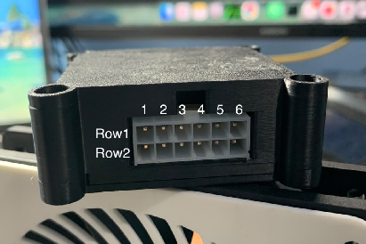
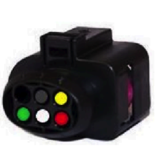

# WBO CAN Controller

## Gambaran Umum



WBO CAN Controller adalah **wideband oxygen controller** untuk sensor Bosch
**LSU 4.9**. Modul ini membaca sensor, menghitung nilai lambda/AFR, lalu
mengirimkannya ke bus CAN — sehingga ECU membacanya tanpa memerlukan input
analog khusus.

Modul memakai **protokol wideband rusEFI**, jadi hanya bisa dipasangkan dengan
**ECU berbasis rusEFI**, termasuk seluruh lini Mazduino.

Kegunaannya ada dua:

- **Menghemat pin ECU.** Sensor wideband butuh enam kabel dan rangkaian
  pengendali pemanas tersendiri. Dengan modul ini, ECU cukup terhubung ke bus
  CAN yang mungkin sudah terpasang.
- **Menambah sensor kedua.** Untuk mesin dengan dua bank, dua modul bisa
  dipasang di bus yang sama.

Modul memakai konektor **Molex 2x6 (12 pin)** yang membawa daya, CAN, dan
seluruh enam kabel sensor dalam satu konektor.

---

## Pinout Konektor

Konektor Molex 2x6, dilihat dari sisi kabel:

| Baris | Pin 1 | Pin 2 | Pin 3 | Pin 4 | Pin 5 | Pin 6 |
| :---- | :---- | :---- | :---- | :---- | :---- | :---- |
| **Baris 1 (atas)** | Heater+ | CANH | LSU_Un | LSU_Rtrim | LSU_Vm | *kosong* |
| **Baris 2 (bawah)** | +12V | CANL | *kosong* | Heater- | LSU_Ip | GND |

Ringkasnya per fungsi:

| Fungsi | Pin |
| :---- | :---- |
| Daya | +12V (Baris 2, Pin 1) dan GND (Baris 2, Pin 6) |
| CAN | CANH (Baris 1, Pin 2) dan CANL (Baris 2, Pin 2) |
| Pemanas sensor | Heater+ (Baris 1, Pin 1) dan Heater- (Baris 2, Pin 4) |
| Sinyal sensor | LSU_Un, LSU_Rtrim, LSU_Vm, LSU_Ip |

> **Perhatikan Heater+ dan +12V.** Keduanya sama-sama Pin 1, hanya beda baris.
> Tertukar berarti pemanas sensor tersambung langsung ke 12V tanpa kendali
> modul, dan sensor akan rusak karena kepanasan. Pastikan baris konektornya
> benar sebelum menyalakan daya.

---

## Wiring Sensor LSU 4.9



Warna kabel di bawah adalah warna standar Bosch LSU 4.9, jadi berlaku untuk
sensor asli maupun konektor penggantinya.

Tabel ini menyambungkan dua konektor yang berbeda, jadi perhatikan kolomnya:
**Pin Sensor** adalah nomor pin di konektor LSU 4.9 milik sensor, sedangkan
**Posisi di Konektor Modul** adalah tujuannya di konektor Molex 2x6 milik WBO
CAN Controller.

| Pin Sensor (LSU) | Warna Kabel | Sinyal | Posisi di Konektor Modul |
| :---- | :---- | :---- | :---- |
| 1 | Merah | LSU_Ip | Baris 2, Pin 5 |
| 2 | Kuning | LSU_Vm | Baris 1, Pin 5 |
| 3 | Putih | Heater- | Baris 2, Pin 4 |
| 4 | Abu-abu | Heater+ | Baris 1, Pin 1 |
| 5 | Hijau | LSU_Rtrim | Baris 1, Pin 4 |
| 6 | Hitam | LSU_Un | Baris 1, Pin 3 |

Nomor pin di kedua sisi tidak berurutan satu sama lain — Pin 1 sensor tidak
menuju Pin 1 modul. Ikuti **warna kabelnya**, jangan mencocokkan nomor pin.

---

## Wiring Daya dan CAN

**Daya.** Ambil +12V dari jalur yang **ikut mati saat kunci kontak off**,
jangan langsung dari aki. Pemanas sensor menarik arus cukup besar dan akan
mengosongkan aki kalau modul tetap menyala saat mesin mati.

**Ground.** Sambungkan GND ke titik ground yang sama dengan ECU. Ground yang
berbeda antara modul dan ECU membuat pembacaan bergeser dan bisa mengganggu
komunikasi CAN.

**CAN.** CANH dan CANL harus berupa **kabel berpilin (twisted pair)**, dan bus
memerlukan resistor terminasi **120 Ω di kedua ujung** — bukan di setiap
perangkat. Kalau modul ini berada di ujung bus, salah satu terminasi ada di
sini; kalau di tengah, tidak perlu terminasi sama sekali.

Kesalahan paling umum: memasang terminasi di setiap perangkat. Tiga resistor
120 Ω paralel membuat impedansi bus terlalu rendah dan komunikasi berhenti
total.

---

## Menghubungkan ke ECU dan Dash

Alur datanya bertingkat, satu arah:

```
Sensor LSU 4.9  →  WBO CAN Controller  →  bus CAN  →  ECU Mazduino  →  Dash
```

**Dash tidak membaca modul ini secara langsung.** Yang ditampilkan dash adalah
nilai AFR yang sudah diolah ECU, dikirim lewat protokol ECU seperti data mesin
lainnya. Jadi tidak ada yang perlu dikonfigurasi di sisi dash — begitu ECU
membaca lambda dengan benar, angkanya ikut muncul.

### Setelan di ECU

**Bitrate bus CAN modul ini 500 kbps**, dan bus di sisi ECU harus diset sama.
Bitrate yang berbeda tidak membuat data "sebagian masuk" — sama sekali tidak ada
yang terbaca.

Lalu di bagian konfigurasi lambda sensor:

- **Wideband mode** — pilih mode wideband internal rusEFI, bukan *Analog* dan
  bukan *AEM X-Series*
- **Sensor index** — `0` untuk modul pertama, `1` untuk modul kedua

Dua modul dalam satu bus wajib memakai index yang berbeda. Kalau index-nya sama,
keduanya saling menimpa dan pembacaannya kacau.

---

## Catatan Penting Sensor Wideband

Sensor LSU 4.9 adalah komponen habis pakai, dan sebagian besar kerusakannya
berasal dari pemasangan, bukan dari umur.

**Posisi pemasangan.** Pasang sensor **minimal 10° di atas garis horizontal**,
dengan ujung sensor mengarah sedikit ke atas. Kalau dipasang mendatar atau
menghadap ke bawah, air hasil kondensasi knalpot akan menggenang di ujung
sensor. Saat pemanas menyala, air itu mendidih seketika dan meretakkan keramik
di dalamnya.

**Jangan menyalakan modul tanpa sensor terpasang di knalpot.** Pemanas yang
menyala di udara terbuka membuat sensor kepanasan karena tidak ada aliran gas
yang mendinginkannya.

**Bahan bakar bertimbal (leaded) merusak sensor.** Timbal melapisi elemen
sensor secara permanen. Untuk mesin balap yang memakai avgas atau bensin
bertimbal, sensor ini tidak cocok dipakai permanen.

**Hindari silikon.** Uap dari sealant RTV, sebagian cairan pembersih, dan
beberapa jenis spray bisa meracuni sensor. Kalau memakai sealant di sistem
knalpot atau intake, pastikan jenisnya *sensor-safe*.

**Pembacaan baru valid setelah sensor panas.** Beberapa detik pertama setelah
modul menyala, angkanya belum bisa dipercaya. Ini normal dan bukan tanda
kerusakan.

---

## Troubleshooting

**Tidak ada data di bus CAN**

- Periksa CANH dan CANL tidak tertukar
- Pastikan terminasi 120 Ω ada di **kedua ujung** bus, bukan di tiap perangkat
- Pastikan bus CAN di ECU diset **500 kbps**
- Pastikan ECU memakai mode wideband rusEFI, dan sensor index-nya cocok
- Ukur tegangan di pin +12V dan GND langsung di konektor modul

**AFR terbaca tapi angkanya tidak masuk akal**

- Cek seluruh enam kabel sensor terpasang di posisi yang benar
- Cek ground modul dan ECU berada di titik yang sama
- Cek tidak ada kebocoran knalpot sebelum posisi sensor; udara luar yang masuk
  membuat pembacaan tampak jauh lebih miskin (lean) dari sebenarnya

**AFR selalu menunjukkan sangat miskin (lean)**

- Kebocoran knalpot di antara mesin dan sensor adalah penyebab paling umum
- Pada mesin yang baru dihidupkan, tunggu sampai sensor mencapai suhu kerja

**Sensor cepat rusak berulang kali**

- Periksa sudut pemasangan; kondensasi adalah penyebab paling sering
- Periksa jenis bahan bakar yang dipakai
